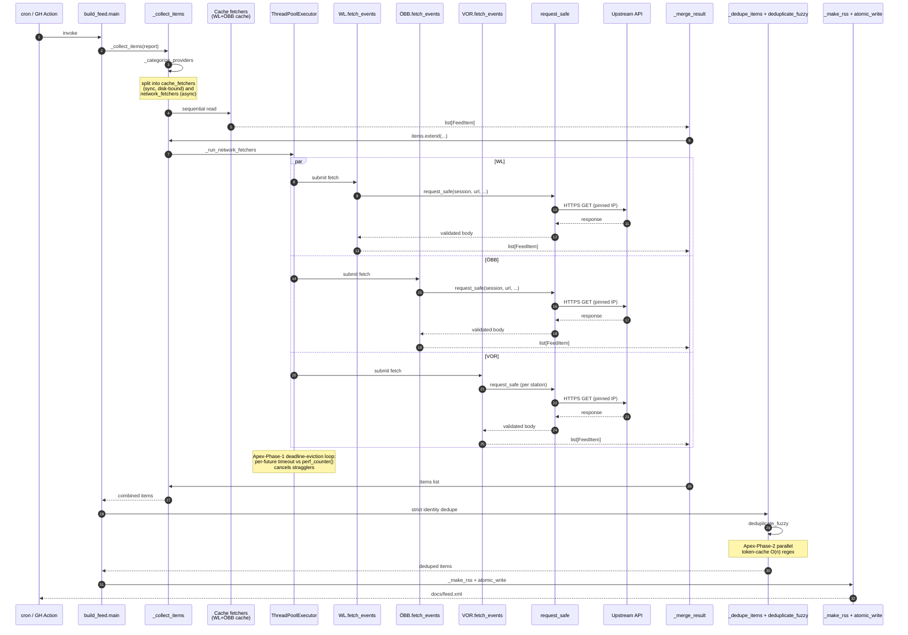
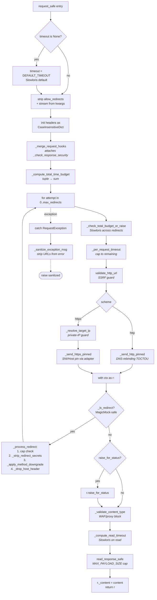
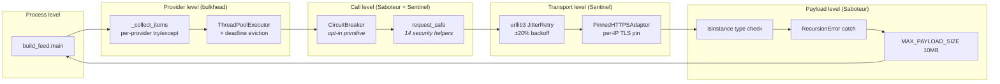
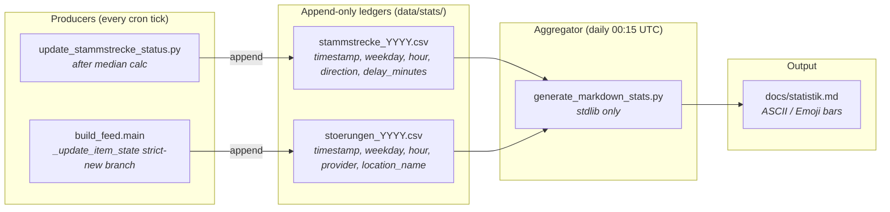

# Architecture Map — Wien ÖPNV Feed

This document is the visual companion to the README and the `.jules/`
journals. It is written for a developer joining the project six months
from now: someone who needs to understand **how the system fits
together** before diving into any one file.

The diagrams below are rendered automatically by GitHub. If you are
reading this in a non-Mermaid-aware viewer, the same information is
also expressed prose-first under each diagram.

---

## 1. The Transit Data Fetching Pipeline

The headline workflow: a cron job (or GitHub Action) launches
`python -m src.build_feed`, which orchestrates 4–5 transit-data
providers in parallel, deduplicates the merged events, and writes a
single RSS feed.



**Why each step matters:**

- **`_categorize_providers`** decides which providers can run synchronously (their loader has a `_provider_cache_name` attribute → reads from disk) vs. asynchronously (real network fetch). Separating them up front keeps the executor pool focused on I/O-bound work.
- **The `par … and …` block** is the **bulkhead**: a crash in any one provider's `fetch_events` is caught by `_drain_completed_futures` and recorded as that provider's error, while the others continue. This is what makes the system never "all-down on one bad upstream."
- **The Apex-Phase-1 callout** is critical: without bounded `wait()` timeouts the loop would busy-spin against `perf_counter()` (see `.jules/apex.md` 2026-05-07 entry).
- **`request_safe`** is the security state machine — see diagram §2 below.
- **`deduplicate_fuzzy`** is Apex-Phase-2 territory: the parallel `merged_cache` reduces O(n²) regex re-parsing to O(n) (see `.jules/apex.md`).

---

## 2. The `request_safe` Security State Machine

`request_safe` is a single 75-line orchestrator that calls 14 cohesive
security helpers in a strict order. Each helper documents the attack
vector it mitigates. The flowchart below shows the order; the prose
beneath summarizes why each gate exists.



**Why each gate exists** (also in helper docstrings):

| Gate | Mitigates |
|---|---|
| Slowloris default timeout | Caller forgetting to pass timeout → indefinite hang |
| Disable auto-redirects | DNS-rebinding TOCTOU between safety check and connect |
| `_merge_request_hooks` | Silent skip of `_check_response_security` IP-verification |
| `_compute_total_time_budget` (tuple sum) | Adversary chaining redirects to stretch wall-clock budget |
| `_check_total_budget_or_raise` | Slowloris across redirects |
| `_per_request_timeout` | Per-step timeout decay across the chain |
| `validate_http_url` | SSRF via internal/private hostnames |
| `_resolve_target_ip` | SSRF via DNS resolution returning a private IP |
| `_send_http_pinned` | DNS-rebinding TOCTOU on plain HTTP |
| `_send_https_pinned` | DNS-rebinding TOCTOU on HTTPS + SNI/Host mismatch |
| `_is_redirect` (MagicMock guard) | False-positive redirects in mock-based tests |
| `_strip_redirect_secrets` | Token / credential leak across origins |
| `_apply_method_downgrade` | RFC-7231 method preservation/downgrade compliance |
| `_drop_host_header` | SNI/Host mismatch on the redirected request |
| `_validate_content_type` | WAF/proxy block-page misinterpretation (text/html attack) |
| `_compute_read_timeout` | Slowloris on the body-read side |
| `read_response_safe` | Payload-size cap (MAX_PAYLOAD_SIZE = 10 MB) |
| `_sanitize_exception_msg` | Sensitive URLs leaking into error messages and logs |

The full audit lives in `.jules/omega.md` (2026-05-07 entry).

---

## 3. Resilience-Layer Stack

The system has five layered defences against a hostile network or
upstream. Each layer has its own scope; together they form
defence-in-depth.



**Layer-by-layer rationale:**

- **Process level** — the cron entry point. If `main()` raises, the cron run is the failure unit; this is intentional so a corrupt write doesn't ship a half-built feed.
- **Provider level** — `_collect_items` wraps each provider's loader in a try/except so one provider's exception cannot drop the others' items. The ThreadPoolExecutor + Apex-Phase-1 deadline-eviction loop bounds wall-clock for unresponsive providers.
- **Call level** — `request_safe` is the per-call security state machine (§2). `CircuitBreaker` is a Saboteur-pass primitive available for adoption (currently used by Google Places and as a pattern reference for future providers).
- **Transport level** — `JitterRetry` (in `session_with_retries`) handles transient 5xx / connection-reset with jittered exponential backoff. `PinnedHTTPSAdapter` keeps the TLS handshake's SNI on the original hostname while the TCP connect targets the resolved (vetted) IP.
- **Payload level** — once bytes arrive, every provider validates the top-level type (Zero-Trust shape), handles `RecursionError` from JSON depth-bombs, and operates within the 10 MB body cap.

---

## 4. Provider Plugin Contract

Adding a new provider takes three steps. The diagram shows what your
new module must export and how `_collect_items` discovers it.

```mermaid
flowchart TB
    A[Your new module:<br/>src/providers/yourapi.py] --> B[def fetch_events<br/>timeout: int = 25<br/>-&gt; list[FeedItem]]
    A --> C[Optional:<br/>fetch_events._provider_cache_name<br/><i>marks as disk-bound</i>]

    D[Registration:<br/>register_provider env_var, loader<br/>cache_key=...] --> E[ProviderSpec stored in registry]
    E --> F[iter_providers] --> G[_collect_items.<br/>_categorize_providers]
    G --> H{_provider_cache_name<br/>set?}
    H -- yes --> I[cache_fetchers<br/><i>sync</i>]
    H -- no --> J[network_fetchers<br/><i>async via executor</i>]
```

**Required contract:**

```python
# src/providers/yourapi.py
from src.feed_types import FeedItem

def fetch_events(timeout: int = 25) -> list[FeedItem]:
    """Return a list of typed feed items for this provider.

    Must NOT raise on network errors — log and return an empty list.
    Must NOT block longer than ``timeout`` seconds total.
    Must validate top-level payload shape before parsing (Zero-Trust).
    """
    ...
```

**Recommended adoption pattern (Saboteur's CircuitBreaker):**

```python
from src.utils.circuit_breaker import CircuitBreaker, CircuitBreakerOpen

_BREAKER = CircuitBreaker("yourapi", failure_threshold=5, recovery_timeout=120.0)

def fetch_events(timeout: int = 25) -> list[FeedItem]:
    try:
        return _BREAKER.call(_actual_fetch, timeout=timeout)
    except CircuitBreakerOpen:
        log.warning("yourapi breaker open; returning empty list")
        return []
```

The breaker logs its own state transitions, so operators see
`CircuitBreaker[yourapi]: CLOSED → OPEN after 5 consecutive failures`
in the build log without any extra wiring.

---

## 5. OSM-First Station-Directory Enrichment

Station coordinates and metadata are populated by a layered enrichment
pipeline orchestrated by `scripts/update_station_directory.py`. The
hierarchy is **strictly OSM-first**: OpenStreetMap (Overpass API) is
the primary directory source, and Google Places is demoted to a
**secondary fallback** that only ever processes stations OSM could not
resolve.

```mermaid
flowchart LR
    A[ÖBB Verzeichnis<br/>(Excel)] --> B[Station list<br/>without coordinates]
    B --> C[CI gate:<br/>scripts/check_overpass_status.py]
    C -- mirror up --> D[OSM Overpass<br/>(src/places/osm_client.py)]
    C -- mirror down --> E[Skip OSM<br/>via WIEN_OEPNV_OSM_ENRICH=0]
    D --> F[CircuitBreaker<br/>5 fail / 5 min cool-off]
    F --> G[merge_places<br/>(name + distance match)]
    G --> H[Stations missing coords?]
    E --> H
    H -- yes --> I[Google Places fallback<br/>(strict missing subset only)]
    H -- no --> J[stations.json]
    I --> J
```

**Why OSM-first:**

- **Open data, no quota.** The Overpass API is publicly reachable
  without an API key and operates under a fair-use policy. Every
  Vienna station-directory refresh would otherwise burn the Google
  Places monthly free-tier quota, which is finite and shared with
  other ad-hoc verification runs.
- **Editor-maintained passenger names.** The `_NAME_PRIORITY` ladder
  in `src/places/osm_client.py:_select_name` selects
  `name:de` → `name` → `official_name(:de)` → `loc_name(:de)` →
  `alt_name(:de)` → `short_name(:de)`. Long passenger-friendly forms
  (`"Wien Hauptbahnhof"`, `"Wien Praterstern"`) consistently win over
  cryptic ÖBB internal abbreviations while compound structures stay
  intact because the long-form keys are picked first.
- **Strict typing.** The Overpass tag bag is exposed as the
  `OSMTags` TypedDict (see `src/places/osm_client.py`). Every key the
  project actually consumes (naming, classification, accessibility,
  operator metadata) is enumerated with `NotRequired[str]`, so
  `mypy --strict` catches misspelled tag reads at every call site.

**Why Google Places is the fallback only:**

- After the OSM merge runs, `_stations_missing_coordinates` filters
  the station list to exactly the entries that still lack `latitude`
  / `longitude`. That subset — and **only** that subset — is passed
  to `_enrich_with_google_places(..., missing_subset=...)`. Stations
  OSM already resolved are never re-keyed by the fallback even when
  a Google Place happens to share their name.
- When OSM covers every station with coordinates the Google Places
  call is skipped entirely. The free-tier quota (`PLACES_LIMIT_*`
  env-vars) is preserved for genuinely missing entries.

**Network resilience layers:**

1. **CI smoke test** (`scripts/check_overpass_status.py`) probes
   the Overpass endpoint with an `out count` query at the start of
   the `update-stations.yml` workflow. If Overpass is unreachable the
   workflow flips `WIEN_OEPNV_OSM_ENRICH=0`, skipping the OSM run
   entirely instead of waiting on stalled urllib3 retries.
2. **`urllib3` JitterRetry** (`session_with_retries`) handles
   transient 5xx / connection-reset within a single OSM call.
3. **`CircuitBreaker`** (`src/places/osm_client.py:_BREAKER`,
   `failure_threshold=5`, `recovery_timeout=300s`) remembers failure
   streaks across calls. Five consecutive failures park the breaker
   in OPEN for five minutes, short-circuiting every subsequent call
   to `OSMOverpassError` so the cron pipeline doesn't self-DDoS the
   public mirror.
4. **`request_safe`** wraps every OSM call in the security state
   machine (§2): SSRF, redirect, content-type, slowloris, payload
   cap.
5. **Test-isolation** — `tests/conftest.py` registers an autouse
   `reset_circuit_breakers` fixture that returns every known
   project-owned breaker to CLOSED before each test. Tests that
   intentionally trip a breaker (such as
   `test_fetch_stations_breaker_opens_after_repeated_failures`)
   no longer leak OPEN state to subsequent tests, eliminating an
   entire class of order-dependent flakes.

The relevant CLI flags / env vars:

| Flag / env | Default | Purpose |
|---|---|---|
| `--osm-enrich` / `--no-osm-enrich` | enabled | CLI toggle for the OSM step |
| `WIEN_OEPNV_OSM_ENRICH` | `1` | Env override; `0` skips OSM (used by CI when the smoke check fails) |
| `--google-enrich` / `--no-google-enrich` | enabled | CLI toggle for the Google Places fallback |
| `OVERPASS_URL` | `overpass-api.de` | Trusted-mirror override; rejected unless on the allow-list |
| `MERGE_MAX_DIST_M` | `150` | Distance threshold for the dedup match in `merge_places` |

---

## 6. Statistics & Dashboard Pipeline

Operational metrics live entirely outside the RSS pipeline. Two
append-only CSV ledgers under `data/stats/` capture every relevant
observation as it happens; a separate daily GitHub Actions job
aggregates them into a static Markdown dashboard at
`docs/statistik.md`. The hot-path build never blocks on
observability I/O.



### Architectural goals

| Goal | Embodied by |
| --- | --- |
| **CI/CD decoupling** — the daily aggregator job runs on its own cron, never blocks `build-feed.yml` | `.github/workflows/generate-stats.yml` (cron `15 0 * * *`, `concurrency: generate-stats-${{ github.ref }}`) |
| **Strictly zero data-science dependencies** — no `numpy`, `pandas`, `matplotlib`; CI install stays sub-second | `scripts/generate_markdown_stats.py` imports only `csv`, `collections`, `datetime`, `statistics`, `pathlib`, `zoneinfo`, `argparse` |
| **Append-only, lock-free producers** — single-line writes on POSIX are atomic below `PIPE_BUF` (4 KiB), so concurrent cron ticks cannot interleave bytes mid-line | `src/utils/stats.py:_append_row` (mode `"a"`, no `flock`) |
| **Strict-new gating for disruptions** — long-lived events recorded once, not once per build | `src/build_feed.py:_update_item_state` records only on the *strict* state-cache miss (neither `_identity` nor `guid` had a prior entry) |
| **Idempotent, byte-stable output** — re-running the aggregator on identical input produces byte-identical Markdown so `git-auto-commit-action` is a no-op when nothing changed | Stable secondary sort (alphabetical) breaks every tie in `render_top_locations`; renderer never reads `now()` outside the timestamp shown in the header |
| **Per-year file rotation** — individual ledger size stays bounded even over multi-year operation | Filename derived from the row's Vienna-local `timestamp.year`, not process clock |

### Resiliency layers

The producers are observability, not core functionality, so every
failure path is **best-effort, no-throw**: any `OSError` from the
writer is logged at WARNING and swallowed. Production pipelines never
crash because the disk filled up.

The aggregator, by contrast, is the choke point that has to read
*untrusted* on-disk bytes (a planted-huge CSV from a compromised CI
runner is the canonical threat model). Three layered defences cover
it:

1. **Bounded reads** — every CSV is loaded through
   `read_capped_text` (open + `fstat` on the open fd + capped
   `read(MAX_CSV_BYTES + 1)`) and parsed via `csv.reader` over an
   in-memory `io.StringIO`. The "no bare `csv.reader(handle)` in
   `src/` or `scripts/`" invariant is enforced by
   `tests/test_sentinel_csv_size_bomb.py`.
2. **Malformed-row tolerance** — `_parse_stammstrecke_rows` /
   `_parse_stoerung_rows` skip individual rows that fail
   `fromisoformat` or `float()`. A single fat-fingered manual edit
   never corrupts the entire dashboard.
3. **Atomic dashboard write** — the rendered Markdown lands on disk
   through `src.utils.files.atomic_write`. A kill-signal mid-render
   cannot replace the previous dashboard with a half-written file.

### Test isolation

The production writers default to `<repo>/data/stats/` via
`src.utils.stats.DEFAULT_STATS_DIR`. An autouse fixture
`isolate_stats_writes` in `tests/conftest.py` monkey-patches that
constant to a per-test `tmp_path` for **every** test in the suite, so
any test that transitively exercises a hot path which records stats
(the `_update_item_state` strict-new branch, the Stammstrecke
processing loop) cannot pollute the committed CSV ledger. Tests that
explicitly target a different `stats_dir` (the dedicated unit tests in
`tests/test_utils_stats.py`) are unaffected because the explicit
keyword always wins inside `stats_path`.

### What the dashboard answers

| Question | Section in `docs/statistik.md` |
|---|---|
| **When** do Stammstrecke delays occur? | "Stammstrecke" — weekday + hour distributions of both observation count and average delay |
| **Where** (and **when**) are disruption hotspots? | "Störungen" — per-provider table, weekday + hour distributions, top-5 hotspots with per-location hourly profile |

The location heuristic in `extract_location_name` tries — in order —
`zwischen X und Y` (capture group 1), then `Wien <Name>`, then the
first capitalised multi-word token outside a small stopword set
(`Bauarbeiten`, `Verspätung`, `Linie`, …). Falls back to
`"unbekannt"` so the dashboard always renders, even on adversarial
provider input.

---

## 7. VOR/VAO API Rate-Limit Optimization (2026-05-09)

Die VOR/VAO ReST API erlaubt **100 Requests pro Tag** (`VAO Start`-
Kontingent). Nach der Migration des Stammstrecken-Monitors von
`pyhafas` auf die VOR `/trip`-API (siehe
[`docs/reference/stammstrecke_provider_logic.md`](reference/stammstrecke_provider_logic.md))
ist der Monitor mit 96 Calls/Tag der dominante VOR-Konsument. Drei
strikt aufeinander abgestimmte Limits halten das Projekt unter dem
Tagesbudget:

| Konsument | Default-Calls/Tag | Konfigurierbar |
| :--- | ---: | :--- |
| **Stammstrecke `/trip`** (`*/30` × 2 Richtungen) | 96 | `cron`-Plan in `build-feed.yml`, `MAX_TRIPS_PER_QUERY` |
| **Station-Enrichment `location.name`** (monatlich, Stammstrecke-Whitelist) | ~10 (1× pro Monat) | `STAMMSTRECKE_VOR_IDS` in `scripts/update_vor_stations.py` |
| **Disruption-Polling `departureBoard`** | **0** (default) | `VOR_MONITOR_STATIONS_WHITELIST` env (default: leerer String) |
| **Tagesbudget gesamt** | **96 / 100** | — |

Drei zusammenwirkende Mechanismen schützen das Budget:

1. **`DEFAULT_MONITOR_WHITELIST = ""`** (`src/providers/vor.py`).
   Das Disruption-Polling über die VAO API ist standardmäßig
   deaktiviert. Operatoren, die das Legacy-Verhalten brauchen,
   setzen `VOR_MONITOR_STATIONS_WHITELIST` als Env-Variable.

2. **`STAMMSTRECKE_VOR_IDS`** (`scripts/update_vor_stations.py`).
   Live-`location.name`-Enrichment ist auf die 10 Stammstrecke-
   S-Bahn-Stationen beschränkt; alle anderen Station-IDs fallen
   beim Stations-Verzeichnis-Update auf die gepinnte
   `data/vor-haltestellen.csv` zurück.

3. **`_charge_one_request`** (`scripts/update_stammstrecke_status.py`).
   Vor jedem `/trip`-Call wird ein Quota-Slot via
   `vor_provider.save_request_count` reserviert; ein Lauf, der das
   Tagesbudget reißen würde, raised `_QuotaExceeded` *vor* dem
   Network Call und schreibt einen leeren Cache.

Die monatliche Burst durch das Stations-Enrichment fällt nur auf den
1. eines Monats (Cron `0 1 1 * *`); selbst mit voller Stammstrecke-
Aktivität an diesem Tag bleiben 4 Calls Puffer. Sollte das Budget in
Zukunft enger werden, sind die niedrig-hängenden Hebel:

* Cron `*/30` → `*/60` (halbiert Stammstrecke auf 48 Calls/Tag).
* `MAX_TRIPS_PER_QUERY = 5` → `3` (kein API-Effekt, da `numF` ein
  Server-side-Cap ist und VAO mehrere Trips pro Call erlaubt).
* Operating-Hours-Cron (`0,30 4-23 * * *` statt `*/30 * * * *`) — die
  Stammstrecke fährt zwischen 00:30 und 04:00 nur ausgedünnt, das
  Monitoring liefert dort kaum Signal.

---

## 8. Cross-references

- **Security audit history** → `.jules/sentinel.md`
- **Performance optimisations** → `.jules/apex.md`
- **Static-analysis hygiene** → `.jules/purist.md`
- **Complexity refactors** → `.jules/surgeon.md`
- **`request_safe` joint refactor** → `.jules/omega.md`
- **Chaos audit + RecursionError fix** → `.jules/saboteur.md`
- **DX / docs / cartography** → `.jules/scribe.md` (this document's companion)

The `.jules/` journals are the project's institutional memory. When
adding a new defence, optimisation, or refactor, append an entry there
and (if the change is architecturally visible) update this map.
