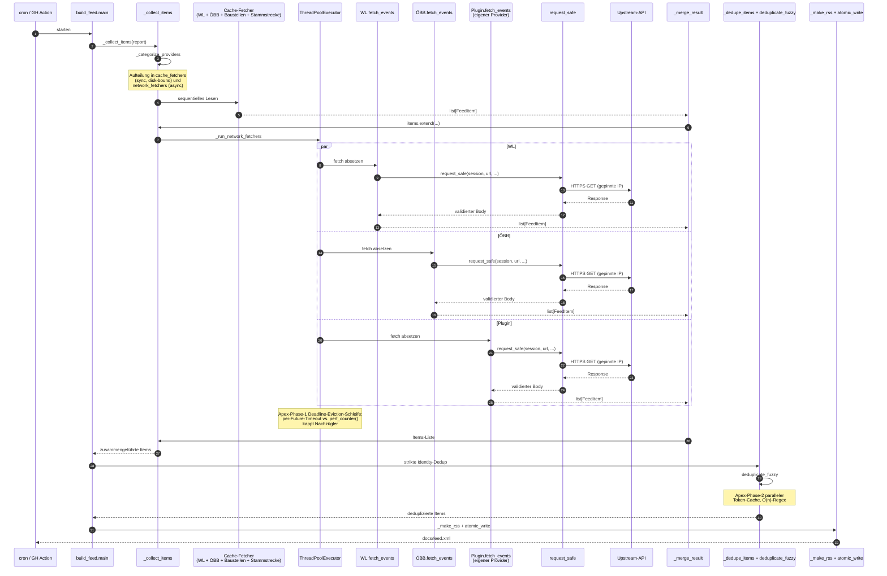
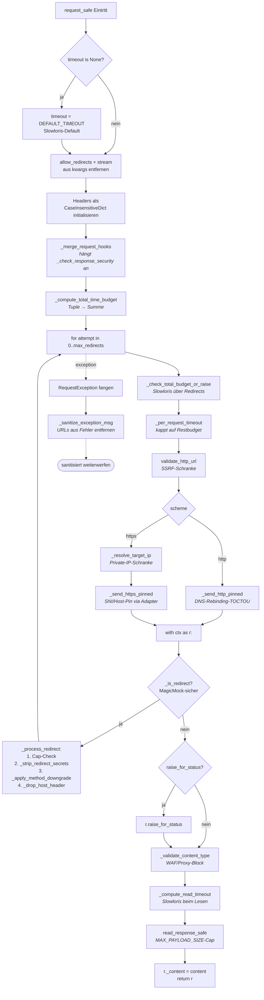
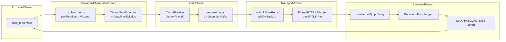
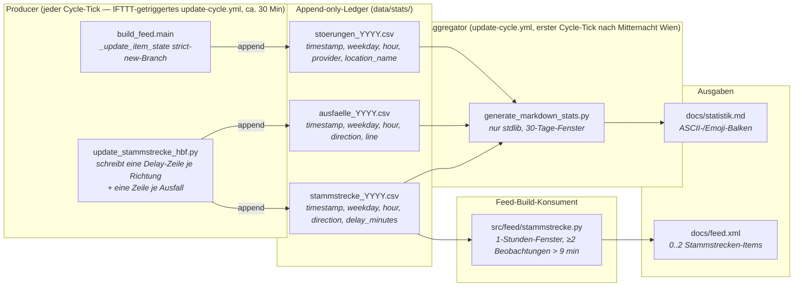

# Architektur-Karte — Wien ÖPNV Feed

Dieses Dokument ist die visuelle Ergänzung zur README. Es ist für
Entwickler:innen geschrieben, die in einem halben Jahr zum Projekt
stoßen: jene Person, die verstehen muss, **wie das System
zusammenhängt**, bevor sie sich in irgendeine einzelne Datei stürzt.

Die Diagramme weiter unten werden von GitHub automatisch gerendert.
Wer das hier in einem Viewer ohne Mermaid-Unterstützung liest, findet
zu jedem Diagramm dieselbe Information zusätzlich als Fließtext
darunter.

---

## 1. Die Pipeline für den Abruf der Verkehrsdaten

Der zentrale Workflow: Ein Cron-Job (bzw. die GitHub-Action
`update-cycle.yml`) startet `python -m src.cli feed build` (das wiederum
`build_feed.main()` aufruft), invokiert die registrierten
Verkehrsdaten-Provider, dedupliziert die zusammengeführten Events und
schreibt einen einzelnen RSS-Feed.

> **Hinweis zum aktuellen Default-Setup:** Das Diagramm illustriert
> beide Provider-Modi des Builders (sync cache vs. async network).
> Im aktuellen Cron-Setup (`update-cycle.yml`) werden die HTTP-Fetcher
> für WL, ÖBB und Baustellen aber **in eigenen Workflow-Steps** vor
> dem `feed build` ausgeführt und schreiben in `cache/<provider>/`;
> der Feed-Build selbst sieht alle Default-Provider (WL, ÖBB,
> Baustellen, Stammstrecke) deshalb als **cache_fetchers** (sync,
> disk-bound). Der Async-Pfad ist die Plug-in-Aufnahme-Stelle für
> nicht-cache-basierte Drittprovider — siehe §4.



**Warum jeder Schritt zählt:**

- **`_categorize_providers`** entscheidet, welche Provider synchron laufen können (Loader trägt das Attribut `_provider_cache_name` → liest von der Platte) und welche asynchron (echter Netzwerk-Abruf). Diese Trennung hält den Executor-Pool auf I/O-gebundene Arbeit fokussiert.
- **Der `par … and …`-Block** ist das **Bulkhead-Prinzip**: Ein Crash in einem einzelnen `fetch_events`-Aufruf wird von `_drain_completed_futures` abgefangen und als Fehler genau dieses Providers verbucht — die anderen laufen weiter. Genau das macht das System nie „komplett wegen einer kaputten Quelle aus".
- **Der Hinweis auf Apex-Phase-1** ist entscheidend: Ohne gedeckelte `wait()`-Timeouts würde die Schleife gegen `perf_counter()` busy-spinnen.
- **`request_safe`** ist die Security-State-Machine — siehe Diagramm §2.
- **`deduplicate_fuzzy`** ist Apex-Phase-2-Territorium: Der parallele `merged_cache` reduziert das O(n²)-Regex-Reparsing auf O(n).

---

## 2. Die `request_safe`-Security-State-Machine

`request_safe` ist ein einzelner 75-Zeilen-Orchestrator, der 14
kohäsive Security-Helfer in strikter Reihenfolge aufruft. Jeder Helfer
dokumentiert den Angriffsvektor, den er entschärft. Das Flussdiagramm
unten zeigt die Reihenfolge, die Tabelle darunter fasst zusammen,
warum jede Schranke existiert.



**Warum jede Schranke existiert** (auch in den Helper-Docstrings dokumentiert):

| Schranke | Entschärft |
|---|---|
| Slowloris-Default-Timeout | Aufrufer:in vergisst Timeout → endlos hängender Call |
| Auto-Redirects deaktivieren | DNS-Rebinding-TOCTOU zwischen Sicherheitsprüfung und Connect |
| `_merge_request_hooks` | Stilles Überspringen der `_check_response_security` IP-Verifikation |
| `_compute_total_time_budget` (Tuple-Summe) | Angreifer:in verkettet Redirects, um das Wall-Clock-Budget zu strecken |
| `_check_total_budget_or_raise` | Slowloris über mehrere Redirects |
| `_per_request_timeout` | Per-Step-Timeout-Decay entlang der Kette |
| `validate_http_url` | SSRF über interne/private Hostnames |
| `_resolve_target_ip` | SSRF via DNS-Auflösung mit privater IP |
| `_send_http_pinned` | DNS-Rebinding-TOCTOU auf plain HTTP |
| `_send_https_pinned` | DNS-Rebinding-TOCTOU auf HTTPS + SNI/Host-Mismatch |
| `_is_redirect` (MagicMock-Schutz) | Falsch-positive Redirects in Mock-basierten Tests |
| `_strip_redirect_secrets` | Token-/Credential-Leak über Origin-Grenzen |
| `_apply_method_downgrade` | RFC-7231-konforme Methoden-Erhaltung/-Herabstufung |
| `_drop_host_header` | SNI/Host-Mismatch beim weitergeleiteten Request |
| `_validate_content_type` | Fehlinterpretation der Block-Page eines WAF/Proxys (text/html-Angriff) |
| `_compute_read_timeout` | Slowloris auf der Body-Read-Seite |
| `read_response_safe` | Payload-Größen-Cap (MAX_PAYLOAD_SIZE = 10 MB) |
| `_sanitize_exception_msg` | Sensible URLs lecken in Fehlertexte und Logs |

Das 2026-05-07-Audit hat diese Angriffsfläche geschlossen.

---

## 3. Resilienz-Layer-Stack

Das System trägt fünf gestaffelte Verteidigungslinien gegen ein
feindliches Netzwerk oder eine feindliche Upstream-Quelle. Jede Schicht
hat ihren eigenen Geltungsbereich; zusammen ergeben sie
Defense-in-Depth.



**Schicht für Schicht:**

- **Prozess-Ebene** — der Cron-Eintrittspunkt. Wenn `main()` wirft, ist der Cron-Lauf die Fehler-Einheit; das ist Absicht, damit ein korrupter Schreibvorgang keinen halbgaren Feed veröffentlicht.
- **Provider-Ebene** — `_collect_items` hüllt den Loader jedes Providers in ein try/except, sodass eine Provider-Exception die Items der anderen nicht mit in den Abgrund nimmt. Der `ThreadPoolExecutor` plus die Apex-Phase-1-Deadline-Eviction-Schleife begrenzt das Wall-Clock-Budget für nicht antwortende Provider.
- **Call-Ebene** — `request_safe` ist die per-Call-Security-State-Machine (§2). `CircuitBreaker` ist ein zur Übernahme bereitstehendes Resilienz-Primitiv; die gemeinsam genutzte Klasse `src.utils.circuit_breaker.CircuitBreaker` umhüllt den OSM-Client (`src/places/osm_client.py`), den HAFAS-Client (`src/places/hafas_client.py`) und den Stammstrecken-Hbf-Monitor (`scripts/update_stammstrecke_hbf.py`). Google Places (`src/places/client.py`) trägt einen ad-hoc inline-implementierten 5xx-Counter-Breaker statt des gemeinsamen Primitivs — gleiches Pattern, eigener State.
- **Transport-Ebene** — `JitterRetry` (in `session_with_retries`) behandelt transiente 5xx und Connection-Resets per jitter-belegtem Exponential-Backoff. `PinnedHTTPSAdapter` hält die SNI beim TLS-Handshake auf dem ursprünglichen Hostnamen, während der TCP-Connect die aufgelöste (geprüfte) IP anvisiert.
- **Payload-Ebene** — sobald Bytes eintreffen, validiert jeder Provider den Top-Level-Typ (Zero-Trust-Shape), fängt `RecursionError` aus JSON-Tiefenbomben und arbeitet innerhalb des 10-MB-Body-Caps.

---

## 4. Provider-Plugin-Vertrag

Ein neuer Provider lässt sich in drei Schritten ergänzen. Das Diagramm
zeigt, was dein neues Modul exportieren muss und wie `_collect_items`
es entdeckt.

```mermaid
flowchart TB
    A[Dein neues Modul:<br/>src/providers/yourapi.py] --> B[def fetch_events<br/>timeout: int = 25<br/>-&gt; list[FeedItem]]
    A --> C[Optional:<br/>fetch_events._provider_cache_name<br/><i>markiert als disk-bound</i>]

    D[Registrierung:<br/>register_provider env_var, loader<br/>cache_key=...] --> E[ProviderSpec im Registry abgelegt]
    E --> F[iter_providers] --> G[_collect_items.<br/>_categorize_providers]
    G --> H{_provider_cache_name<br/>gesetzt?}
    H -- ja --> I[cache_fetchers<br/><i>sync</i>]
    H -- nein --> J[network_fetchers<br/><i>async via Executor</i>]
```

**Pflicht-Vertrag:**

```python
# src/providers/yourapi.py
from src.feed_types import FeedItem

def fetch_events(timeout: int = 25) -> list[FeedItem]:
    """Liefert eine typisierte Feed-Item-Liste für diesen Provider.

    Darf bei Netzwerk-Fehlern NICHT raisen — loggen und leere Liste
    zurückgeben.
    Darf insgesamt NICHT länger als ``timeout`` Sekunden blockieren.
    Muss vor dem Parsen den Top-Level-Payload-Typ validieren
    (Zero-Trust).
    """
    ...
```

**Empfohlenes Pattern (CircuitBreaker):**

```python
from src.utils.circuit_breaker import CircuitBreaker, CircuitBreakerOpen

_BREAKER = CircuitBreaker("yourapi", failure_threshold=5, recovery_timeout=120.0)

def fetch_events(timeout: int = 25) -> list[FeedItem]:
    try:
        return _BREAKER.call(_actual_fetch, timeout=timeout)
    except CircuitBreakerOpen:
        log.warning("yourapi breaker open; returning empty list")
        return []
```

Der Breaker loggt seine eigenen State-Übergänge, sodass Operator:innen
ohne zusätzliche Verkabelung Einträge wie
`CircuitBreaker[yourapi]: CLOSED → OPEN after 5 consecutive failures`
im Build-Log sehen.

---

## 5. Drei-Stufen-Stationsverzeichnis-Anreicherung (OSM → HAFAS → Google)

Stationskoordinaten und -Metadaten werden über eine geschichtete
Anreicherungspipeline befüllt, die von
`scripts/update_station_directory.py` orchestriert wird. Die Hierarchie
ist eine **strikt gestufte Kaskade**: OpenStreetMap (Overpass-API) ist
die primäre Quelle, HAFAS (ÖBB Scotty) ist der seit 2026-05-14
eingeführte Level-2-Fallback, und Google Places ist die letzte Stufe,
die ausschließlich Stationen verarbeitet, die die ersten beiden Stufen
nicht auflösen konnten.

> **Hinweis zur GeoNetz-Anreicherung:** Orthogonal zur Koordinaten-Kaskade
> läuft `_enrich_with_geonetz`. Es liest die gepinnte
> `data/oebb_geonetz_stops.json` (eine kompakte Stops-Projektion, die
> `scripts/extract_oebb_geonetz_stops.py` aus dem 23 MiB großen
> ÖBB-Infrastruktur-`GeoNetz_*.zip` extrahiert) und hängt **Identifier-
> Metadaten** an — EVA-Nummer und IFOPT-ID, markiert über den Source-Token
> `oebb_geonetz`. Das ist mit ~390 Stationen die zweithäufigste
> Source-Klasse im Verzeichnis, **liefert aber keine Koordinaten** und ist
> daher keine eigene Tier-Stufe.

```mermaid
flowchart LR
    A[ÖBB-Verzeichnis<br/>(Excel)] --> B[Stationsliste<br/>ohne Koordinaten]
    B --> C[CI-Gate:<br/>scripts/check_overpass_status.py]
    C -- Mirror up --> D[Tier 1: OSM Overpass<br/>(src/places/osm_client.py)]
    C -- Mirror down --> E[OSM überspringen<br/>via WIEN_OEPNV_OSM_ENRICH=0]
    D --> F[OSM CircuitBreaker<br/>5 Fails / 5 Min Cool-off]
    F --> G[merge_places<br/>(Name + Distanz-Match)]
    G --> H[Stationen ohne Koordinaten?]
    E --> H
    H -- ja --> K[Tier 2: HAFAS Mgate<br/>(src/places/hafas_client.py)]
    K --> L[HAFAS CircuitBreaker<br/>5 Fails / 5 Min Cool-off]
    L --> M[Rest noch ohne Koordinaten?]
    M -- ja --> I[Tier 3: Google Places<br/>(nur strikte Restmenge)]
    M -- nein --> J[stations.json]
    H -- nein --> J
    I --> J
```

**Warum OSM zuerst:**

- **Offene Daten, kein Kontingent.** Die Overpass-API ist ohne API-Key
  öffentlich erreichbar und arbeitet unter einer Fair-Use-Policy. Ohne
  diese Stufe würde jeder Wien-Stationsverzeichnis-Refresh das
  Monats-Freikontingent von Google Places verbrauchen — endlich und
  geteilt mit anderen Ad-hoc-Verifikationsläufen.
- **Editor-gepflegte Passagier-Namen.** Die `_NAME_PRIORITY`-Hierarchie
  in `src/places/osm_client.py:_select_name` wählt
  `name:de` → `name` → `official_name(:de)` → `loc_name(:de)` →
  `alt_name(:de)` → `short_name(:de)`. Lange, passagierfreundliche
  Formen (`"Wien Hauptbahnhof"`, `"Wien Praterstern"`) setzen sich
  konsistent gegen kryptische ÖBB-interne Abkürzungen durch, während
  zusammengesetzte Strukturen intakt bleiben, weil die Long-Form-Keys
  zuerst gegriffen werden.
- **Strikte Typisierung.** Der Overpass-Tag-Bag wird als TypedDict
  `OSMTags` exponiert (siehe `src/places/osm_client.py`). Jeder Tag,
  den das Projekt tatsächlich konsumiert (Naming, Klassifizierung,
  Barrierefreiheit, Betreiber-Metadaten), ist mit `NotRequired[str]`
  enumeriert; `mypy --strict` fängt damit jeden Tippfehler bei
  Tag-Reads.

**Warum HAFAS der Level-2-Fallback ist (und Google auf Stufe 3 rutscht):**

- **Betreiber-authoritative Koordinaten und EVA-Nummern.** HAFAS ist
  die hauseigene Routing-Backbone der ÖBB. Eine `LocMatch`-Query
  liefert den kanonischen Stationsrecord zusammen mit der EVA-Nummer
  (`extId`, z. B. `"8100353"` für Wien Hauptbahnhof), die das Projekt
  in jeder HAFAS-aufgelösten Station als Top-Level-Feld
  `hafas_extId` persistiert. Die Antwort-Koordinaten sind in
  Mikrograd codiert (`x=16377778` → `16.377778°`) und werden von
  `src/places/hafas_client.py:_extract_first_location` zu
  WGS84-Floats skaliert.
- **Kein Tages-/Monats-Request-Budget.** Anders als der
  VAO-ReST-Endpoint (gedeckelt auf 100 Req/Tag, reserviert für den
  Stammstrecken-Monitor — siehe §7) und Google Places (Monats-
  Freikontingent, getrackt in `data/places_quota.json`) hat die
  HAFAS-Mgate-API kein publiziertes per-Konsumenten-Limit, das die
  Cron-Pipeline routinemäßig reißen würde. Jede Station, die HAFAS
  auflösen kann, ist eine Station weniger, die das Google-Budget
  belastet.
- **Selbstheilende Credential-Rotation.** Die ÖBB rotiert das
  Mgate-`salt`/`ver`/`aid`-Tripel ohne Vorankündigung. Das
  Begleit-Skript `scripts/sync_hafas_profile.py` läuft in
  `update-stations.yml` **vor** der Anreicherung, extrahiert die
  aktuellen Werte aus dem Open-Source-Profil
  `public-transport/hafas-client` (OEBB-Profil:
  `p/oebb/index.js` + `p/oebb/base.js`) und persistiert sie atomar
  nach `data/hafas_profile.json`. Ein rotiertes Upstream-Profil
  fließt damit automatisch in den nächsten Cron-Tick ein — das
  zwischengespeicherte Profil wird bei jedem Lauf aus der kanonischen
  Quelle neu aufgebaut.
- **Schlanke Integration.** Es wird **keine** externe
  HAFAS-Client-Bibliothek verwendet. Der Mgate-`LocMatch`-Body wird
  direkt konstruiert, durch
  `json.dumps(payload, separators=(',', ':'))` serialisiert
  (sodass die On-the-Wire-Bytes byte-genau dem MAC-Input entsprechen),
  optional mit `MD5(body + salt)` signiert, sobald das Upstream-Profil
  ein Salt trägt (aktuell nicht), und durch dieselbe
  `request_safe`-Security-State-Machine (§2) abgesetzt wie jeder
  andere Provider. Ein dedizierter modulweiter
  `CircuitBreaker("hafas_enrichment", failure_threshold=5,
  recovery_timeout=300.0)` kühlt das Upstream nach einer Fehlerserie
  fünf Minuten lang — eine ÖBB-Störung kann die Cron-Pipeline damit
  nicht in Selbst-DDoS treiben. `CircuitBreakerOpen` wird am
  öffentlichen Einstiegspunkt zu `None` konvertiert: ein
  HAFAS-Schluckauf crasht das Skript nicht, und der
  Google-Places-Fallback läuft trotzdem für die verbliebene Restmenge.

**Warum Google Places die Notfall-Stufe ist:**

- Nachdem OSM und HAFAS gelaufen sind, filtert
  `_stations_missing_coordinates` die Stationsliste auf exakt jene
  Einträge, denen *noch immer* `latitude`/`longitude` fehlt. Diese
  Restmenge — und **nur** diese — wird an
  `_enrich_with_google_places(..., missing_subset=...)` übergeben.
  Stationen, die von OSM oder HAFAS aufgelöst wurden, werden auch
  dann nicht erneut geokodiert, wenn ein Google-Place zufällig
  denselben Namen trägt.
- Wenn OSM und HAFAS alle Stationen mit Koordinaten abdecken, wird
  der Google-Places-Call vollständig übersprungen. Das Freikontingent
  (`PLACES_LIMIT_*`-Env-Vars) bleibt für tatsächlich fehlende Einträge
  reserviert.

**Netzwerk-Resilienz-Schichten:**

1. **CI-Smoke-Test** (`scripts/check_overpass_status.py`) prüft den
   Overpass-Endpoint zu Beginn von `update-stations.yml` mit einer
   `out count`-Query. Ist Overpass nicht erreichbar, setzt der Workflow
   `WIEN_OEPNV_OSM_ENRICH=0` und überspringt den OSM-Lauf, anstatt auf
   stehende urllib3-Retries zu warten.
2. **HAFAS-Profil-Sync** (`scripts/sync_hafas_profile.py`) läuft im
   selben Workflow vor `update_all_stations.py` und aktualisiert
   `data/hafas_profile.json` über `request_safe` aus dem Upstream-
   Community-Profil. Persistiert wird über
   `src.utils.files.atomic_write`, sodass ein abgebrochener Download
   keine korrupte JSON-Sidecar-Datei hinterlassen kann.
3. **`urllib3`-JitterRetry** (`session_with_retries`) behandelt
   transiente 5xx und Connection-Resets innerhalb eines einzelnen
   OSM- oder HAFAS-Aufrufs.
4. **`CircuitBreaker` pro Tier** — `src/places/osm_client.py:_BREAKER`
   und `src/places/hafas_client.py:_BREAKER` öffnen nach fünf
   aufeinanderfolgenden Fehlern und bleiben fünf Minuten offen; beide
   konvertieren `CircuitBreakerOpen` zu einem soft-fail
   `None`/Leerer-Liste-Ergebnis pro Call, sodass die Cron-Pipeline
   mit den noch gesunden Tiers weiterläuft.
5. **`request_safe`** umhüllt jeden OSM- und HAFAS-Call in der
   Security-State-Machine (§2): SSRF, Redirect, Content-Type,
   Slowloris, Payload-Cap.
6. **Test-Isolation** — `tests/conftest.py` registriert eine
   autouse-Fixture `reset_circuit_breakers`, die über
   `_iter_known_breakers()` läuft und vor und nach jedem Test auf
   jedem Eintrag `.reset()` aufruft. Aktuell deckt die Liste
   `src.places.osm_client._BREAKER`; der HAFAS-Breaker
   (`hafas_enrichment`) und der Stammstrecken-Hbf-Breaker
   (`stammstrecke-hbf-vor`) sind noch nicht im Inventar — Tests, die
   diese Breaker absichtlich triggern, müssen selbst `breaker.reset()`
   aufrufen oder den Breaker per `monkeypatch` neu aufbauen. Wer für
   einen neuen Breaker pauschale Isolation wünscht, ergänzt
   `_iter_known_breakers()`.

Relevante CLI-Flags / Env-Vars:

| Flag / Env | Default | Zweck |
|---|---|---|
| `--osm-enrich` / `--no-osm-enrich` | aktiv | CLI-Schalter für den OSM-Schritt |
| `WIEN_OEPNV_OSM_ENRICH` | `1` | Env-Override; `0` überspringt OSM (von CI gesetzt, wenn der Smoke-Test fehlschlägt) |
| `--google-enrich` / `--no-google-enrich` | aktiv | CLI-Schalter für den Google-Places-Fallback |
| `OVERPASS_URL` | `overpass-api.de` | Trusted-Mirror-Override; abgelehnt, wenn nicht auf der Allowlist |
| `MERGE_MAX_DIST_M` | `150` | Distanz-Schwelle für den Dedup-Match in `merge_places` |

HAFAS selbst hat keinen CLI-Schalter — die Stufe ist aktiv, sobald die
Profil-Sidecar-Datei existiert. Wer HAFAS zu Debug-Zwecken überspringen
will, löscht schlicht `data/hafas_profile.json`; der Client kurz-
schließt dann für jede Station auf `None`, hinterlässt eine einzige
Log-Zeile `HAFAS enrichment disabled: …`.

### 5a. Wiener-Linien-OGD-Merge (die vierte Quelle)

Nachdem die OSM-/Google-Places-Anreicherung die ÖBB-verwurzelte
`stations.json` geschrieben hat, läuft `scripts/update_wl_stations.py`
als eigene Stufe im Wrapper-Orchestrator. Dieser Schritt faltet die
Wiener-Linien-OGD-Echtzeit-Stations- und Stop-Daten in das Verzeichnis,
damit der publizierte Feed auch U-Bahn-, Straßenbahn- und Bus-Stops
kennt, die kein ÖBB-Gegenstück haben.

**Quell-Endpoint** (seit PR #1442): das kanonische
`www.wienerlinien.at/ogd_realtime/doku/ogd/wienerlinien-ogd-{haltestellen,haltepunkte}.csv`.
Der historische Proxy `data.wien.gv.at/csv/` wurde in der 60.
Wien-OGD-Phase (September 2025) ausgemustert; `haltepunkte.csv`
lieferte dort HTTP 404. Die Migration ist in
`scripts/update_wl_stations.py:OGD_HALTESTELLEN_URL` dokumentiert.
Beide Dateien werden in jedem Cron-Tick frisch heruntergeladen
(`--download` ist Default-on) und atomar nach
`data/wienerlinien-ogd-{haltestellen,haltepunkte}.csv` geschrieben.
Bei Download-Fehlschlag behält die Pipeline den gepinnten lokalen
Snapshot und läuft weiter.

**Einträge bauen** (`build_wl_entries`):

1. Haltepunkte nach ihrer Haltestellen-DIVA gruppieren.
2. Je Gruppe den kanonischen Namen über `_derive_station_label`
   ableiten: Wenn der Haltestellen-`PlatformText` ein generisches,
   verkehrs-typisches Token ist (`Bahnhof`, `Lokalbahn`,
   `Hauptbahnhof`, `Station`, `Halt`, `Bf`, `Hbf`, `Bahn`, `U-Bahn`)
   und die Haltepunkte einen einzigen bereinigten `StopText` ergeben,
   wird der `StopText` verwendet. Andernfalls bleibt der `PlatformText`
   stehen. Diese Regel (PR #1453) verwandelt operator-nutzlose Labels
   wie `Wien Bahnhof (WL)` in informative Labels wie
   `Wien Tribuswinkel - Josefsthal (WL)`, während der häufige Fall
   (`Karlsplatz`, `Stephansplatz`, …) erhalten bleibt.
3. `in_vienna` aus den aggregierten (Mittelwert-)Haltepunkt-Koordinaten
   auflösen, damit das Flag mit den persistierten
   `latitude`/`longitude`-Werten konsistent bleibt (durch
   `test_coordinates_match_in_vienna_flag` nach PR #1449 gepinnt).
4. `pendler = not in_vienna` setzen, um die historische
   WL-Auto-Promote-Heuristik für Stops in Grenzregionen zu spiegeln
   (PR #1443).
5. Den Eintrag mit `wl_diva`, `wl_stops`, `aliases` bauen — ohne
   synthetische `bst_id`/`bst_code` (PR #1446-Redesign).

**Co-lokierter-Haltestellen-Merge** (PR #1451): Ein Post-Build-Pass
`_merge_colocated_duplicates` faltet Gruppen mit identischem
kanonischen Namen **und** Abstand ≤ 150 m zu einem einzigen Eintrag
zusammen. Wiener-Linien-OGD-Echtzeit listet manche physischen Stops
zweimal (Gegenrichtungs-Bahnsteige mit eigener DIVA); der Merge sammelt
alle Haltepunkte unter einem Eintrag mit der lexikografisch kleinsten
DIVA als `wl_diva`. Gruppen, in denen mindestens ein Paar ≥ 150 m
auseinander liegt, bleiben separat — das sind multimodale Stops an
einem Standort (Bus + Tram-Paar) oder generic-PlatformText-Zufälle,
für die der gemeinsame Display-Name semantisch korrekt ist.

**Namens-Eindeutigkeits-Vertrag** (PR #1452): Der Stationsvalidator
erzwingt die kanonische Namens-Eindeutigkeit nicht mehr. `name` ist
ein operator-zugewandtes Display-Label; die strukturelle Eindeutigkeit
lebt in `wl_diva`/`bst_id`/`vor_id`/`bst_code`. Wiener Linien liefert
legitim duplizierte `PlatformText`-Werte in nicht-mergebaren
Multi-DIVA-Gruppen (10 solche Gruppen im Mai-2026-CSV-Snapshot,
darunter `Lokalbahn` × 4 verteilt über 5,6 km und `Bahnhof` × 2 mit
9,4 km Abstand) — der frühere DIVA-Suffix-Workaround
`_disambiguate_duplicate_names` (`Wien Bahnhof (WL 60205022)` usw.)
hat den RSS-Feed zugemüllt und wurde zusammen mit dem Validator-Gate
entfernt.

**Resilienz**: derselbe `session_with_retries` +
`fetch_content_safe`-Stack wie die anderen Quellen, plus gepinnter
Snapshot-Fallback. Anders als das ÖBB-Workbook (bis PR #1450) haben
die WL-CSVs schon seit der ersten Form von `_download_ogd_csv` einen
Soft-Fail-Pfad.

---

## 6. Statistik- und Dashboard-Pipeline

Drei Append-only-CSV-Ledger unter `data/stats/` fangen jede relevante
Beobachtung ein, sobald sie auftritt. Sie bedienen **zwei Konsumenten**
mit unterschiedlichen Fenstern: das tägliche Markdown-Dashboard
(`docs/statistik.md`, 30-Tage-Fenster) plus die vier README-STATS-
Marker (`STATS:STAMMSTRECKE[_LIVE]` und `STATS:AUSFAELLE[_LIVE]`,
60-Min- und 30-Tage-Snapshots), sowie den RSS-Feed selbst
(Stammstrecken-Sektion, 1-Stunden-Fenster — siehe
[`docs/reference/stammstrecke_provider_logic.md`](reference/stammstrecke_provider_logic.md)).
Der Hot-Path-Build blockiert nie auf Observability-I/O — beide
Konsumenten tolerieren fehlende oder fehlerhafte Zeilen kulant.



### Architektur-Ziele

| Ziel | Verwirklicht durch |
| --- | --- |
| **CI/CD-Entkoppelung** — der tägliche Aggregator läuft genau einmal am Tag (erster Cycle-Tick nach Mitternacht Wien), gegated durch ein Inline-`TZ=Europe/Vienna date +%H%M`-Check in `update-cycle.yml`; die README-STATS-Marker werden bei jedem ca. 30-Min-Cycle-Tick aktualisiert | `.github/workflows/update-cycle.yml`, Step „Refresh statistics dashboard and README snapshot" (der separate `generate-stats.yml`-Workflow wurde zusammen mit den per-Provider-Escapes entfernt; Ad-hoc-Regenerationen laufen jetzt über `manual-full-refresh.yml`) |
| **Strikt null Data-Science-Abhängigkeiten** — kein `numpy`, `pandas`, `matplotlib`; die CI-Installation bleibt sub-sekundär | `scripts/generate_markdown_stats.py` importiert nur `csv`, `collections`, `datetime`, `statistics`, `pathlib`, `zoneinfo`, `argparse` |
| **Append-only, lock-freie Producer** — Einzelzeilen-Writes sind unter POSIX bis `PIPE_BUF` (4 KiB) atomar, parallele Cycle-Ticks können also nicht mitten in einer Zeile Bytes verschachteln | `src/utils/stats.py:_append_row` (Modus `"a"`, kein `flock`) |
| **Strict-new-Gating für Disruptions** — langlebige Events werden einmal aufgezeichnet, nicht einmal pro Build | `src/build_feed.py:_update_item_state` schreibt nur beim *strikten* State-Cache-Miss (weder `_identity` noch `guid` hatten einen Vorgängereintrag) |
| **Idempotente, byte-stabile Ausgabe** — ein erneuter Aggregator-Lauf auf identischer Eingabe erzeugt byte-identisches Markdown, damit `git-auto-commit-action` zum No-op wird, wenn nichts geändert hat | Stabiler Sekundär-Sort (alphabetische Tie-Breaks, z. B. `key=lambda pair: (-pair[1], pair[0])` in `_format_providers_section`, `_format_ausfall_directions_section`, `_format_ausfall_lines_section`) in jeder Rangliste; der Renderer liest `now()` nur für den Zeitstempel im Header |
| **Per-Jahr-Datei-Rotation** — die einzelne Ledger-Größe bleibt auch über Mehrjahres-Betrieb beschränkt | Dateiname wird aus dem Wien-lokalen `timestamp.year` der Zeile abgeleitet, nicht aus der Prozess-Uhr |

### Resilienz-Schichten

Die Producer sind Observability, keine Kern-Funktionalität, deshalb
ist jeder Fehlerpfad **best-effort, no-throw**: ein `OSError` aus dem
Writer wird auf WARNING geloggt und verschluckt. Produktions-Pipelines
crashen nie, weil die Platte vollgelaufen ist.

Der Aggregator hingegen ist der Engpass, der *nicht vertrauenswürdige*
Bytes von der Platte lesen muss (eine im CI-Runner manipulierte
riesige CSV ist das kanonische Threat-Modell). Drei gestaffelte
Verteidigungslinien decken ihn ab:

1. **Begrenzte Reads** — jede CSV wird über `read_capped_text` geladen
   (`open` + `fstat` auf den offenen Filedescriptor + gedeckeltes
   `read(MAX_CSV_BYTES + 1)`) und über `csv.reader` über einem
   In-Memory-`io.StringIO` geparst. Das „kein bares
   `csv.reader(handle)` in `src/` oder `scripts/`"-Invariant ist über
   `tests/test_sentinel_csv_size_bomb.py` durchgesetzt.
2. **Toleranz gegenüber fehlerhaften Zeilen** —
   `_parse_stammstrecke_rows` / `_parse_stoerung_rows` /
   `_parse_ausfall_rows` überspringen einzelne Zeilen, die
   `fromisoformat` oder `float()` werfen. Ein fehlerhaft editierter
   Eintrag legt nicht das ganze Dashboard lahm.
3. **Atomarer Dashboard-Write** — das gerenderte Markdown landet via
   `src.utils.files.atomic_write` auf der Platte. Ein Kill-Signal
   mitten im Render-Vorgang kann das vorhandene Dashboard nicht durch
   eine halbgeschriebene Datei ersetzen.

### Test-Isolation

Die Produktion-Writer defaulten via `src.utils.stats.DEFAULT_STATS_DIR`
auf `<repo>/data/stats/`. Eine autouse-Fixture `isolate_stats_writes`
in `tests/conftest.py` monkey-patcht diese Konstante für **jeden** Test
auf einen per-Test-`tmp_path`, sodass jeder Test, der transitiv einen
Hot-Path triggert, der Statistik schreibt (der
`_update_item_state`-strict-new-Branch, die
Stammstrecken-Processing-Schleife) den committeten CSV-Ledger nicht
verunreinigen kann. Tests, die explizit ein anderes `stats_dir` ansetzen
(die dedizierten Unit-Tests in `tests/test_utils_stats.py`), bleiben
unberührt, weil das explizite Keyword innerhalb von `stats_path` immer
gewinnt.

### Was das Dashboard beantwortet

| Frage | Sektion in `docs/statistik.md` |
|---|---|
| **Wann** treten Stammstrecken-Verspätungen auf? | „Stammstrecke" — Wochentag- und Stunden-Verteilung sowohl der Beobachtungszahl als auch der mittleren Verspätung |
| **Wie häufig** fallen auf der Stammstrecke Züge aus? | „Ausfälle" — per-Richtung- und per-Linien-Tabellen plus Wochentag- und Stunden-Verteilung |
| **Wann** bündeln sich Disruption-Events? | „Störungen" — per-Provider-Tabelle plus Wochentag- und Stunden-Verteilung |

`extract_location_name` ist weiterhin Teil der Producer-Pipeline (siehe
`src/utils/stats.py` und `src/build_feed.py`) und persistiert die
abgeleitete Location pro Disruption-Zeile in
`data/stats/stoerungen_<YYYY>.csv`. Die aktuelle Dashboard-Renderung
aggregiert die Daten allerdings nur nach `provider`, `weekday` und
`hour` (siehe `aggregate_stoerungen` in
`scripts/generate_markdown_stats.py`) — eine frühere „Top-5
Hotspots mit Stundenprofil"-Sektion wurde entfernt, die Roh-Daten in
der CSV bleiben aber für Ad-hoc-Analysen erhalten. Die Heuristik selbst
ist katalog-zentriert: Ein Kandidat wird nur zurückgegeben, wenn er
über die kuratierte Verzeichnisdatei `data/stations.json` (`station_info`)
auflösbar ist. In dieser Reihenfolge versucht sie — (1)
`| Haltestelle:` (WL-`relatedStops`, erster Eintrag, verbatim
akzeptiert), (2) `| Station:` / `| Location:` (WL-Extras), (3)
`in Richtung X` (Stammstrecke-Renderer), (4) `zwischen X und Y`
(ÖBB-Phrasierung, Capture Group 1), (5) `Wien <Stadtteil>`, (6) einen
Sliding-Window-Verzeichnis-Scan über Titel + Beschreibung. Einziger
Fallback ist `"unbekannt"`; einen Freitext-/Token-Fallback samt
Stoppwortliste gibt es bewusst **nicht** mehr (die Freitext-Regex-
Matches wurden 2026-05-09 entfernt, weil deutsche Substantive durchweg
großgeschrieben sind und Störungstypen wie `Demonstration Linie`
fälschlich als Haltestellen akzeptiert wurden). So rendert das Dashboard
auch bei adversarial Provider-Input noch.

---

## 7. VOR/VAO-API — Stammstrecke-only-Scope (2026-05-11)

Die VOR/VAO-ReST-API erlaubt **100 Requests pro Tag** (`VAO Start`-
Kontingent). Seit 2026-05-11 (Operator-Policy „VOR nur noch für die
Verspätungen der Stammstrecke") ist der Stammstrecken-Monitor der
**einzige** automatisierte VOR-Konsument im Projekt. Der frühere
wöchentliche Station-Enrichment-Pfad und das optionale
Disruption-Polling sind aus den automatisierten Pfaden entfernt;
die zugehörigen Helper-Skripte (`update_vor_cache.py`,
`update_vor_stations.py`, `fetch_vor_haltestellen.py`) wurden
2026-05-11 aus `scripts/` gelöscht. VOR-Stop-IDs kommen jetzt
ausschließlich aus dem gepinnten
`data/vor-haltestellen.csv`-Snapshot. Seit 2026-05-15 verbraucht der
Monitor zudem nur noch **48 Calls/Tag** (vorher 96): das aktive
`scripts/update_stammstrecke_hbf.py`-Skript setzt pro Cron-Tick
**eine** `/departureBoard`-Query am Wien Hauptbahnhof ab statt zwei
`/trip`-Queries (Floridsdorf ↔ Meidling). Siehe
[`docs/reference/stammstrecke_provider_logic.md`](reference/stammstrecke_provider_logic.md)
für Details zum Stammstrecken-Monitor.

| Konsument | Default-Calls/Tag | Konfigurierbar |
| :--- | ---: | :--- |
| **Stammstrecke `/departureBoard`** (ca. alle 30 Min × 1 Hbf-Call) | 48 | IFTTT-Cadence des `update-cycle.yml`-Triggers |
| **Station-Enrichment `location.name`** | **0** (Pfad und Skript 2026-05-11 entfernt) | — |
| **Disruption-Polling `departureBoard`** | **0** (Pfad und Skript 2026-05-11 entfernt) | — |
| **Auth-Diagnose** (`verify_vor_access_id.py`, `check_vor_auth.py`) | **0–2** | nur manueller Operator-Aufruf, einmalige Smoke-Tests |
| **Tagesbudget gesamt** | **48 / 100** | — |

Zwei zusammenwirkende Mechanismen schützen das Budget:

1. **Keine automatisierten Nicht-Stammstrecke-Pfade**: Weder
   `update-cycle.yml` noch `update-stations.yml` noch
   `manual-full-refresh.yml` rufen VOR-Disruption-Polling oder
   VOR-Station-Enrichment auf. Die früheren Helper-Skripte existieren
   nicht mehr; nur die Auth-Diagnose-Helfer
   (`scripts/verify_vor_access_id.py`, `scripts/check_vor_auth.py`)
   bleiben für gezielte manuelle Smoke-Tests verfügbar.

2. **`_charge_one_request`** (definiert in
   `scripts/update_stammstrecke_status.py`, vom aktiven
   `update_stammstrecke_hbf.py` per Import wiederverwendet). Vor
   jedem `/departureBoard`-Call wird über
   `vor_provider.save_request_count` ein Quota-Slot reserviert; ein
   Lauf, der das Tagesbudget reißen würde, raised `_QuotaExceeded`
   *vor* dem Network-Call. Defense-in-Depth: `update-cycle.yml`
   schaltet den Step zusätzlich über
   `scripts/preflight_quota_check.py --check vor --margin 1` vor jedem
   Tick aus, sobald der persistierte Counter keinen Slot mehr lässt.

Mit 48 von 100 Calls/Tag bleibt komfortabel ein Puffer von ca. 52
Calls für Operator-Direktaufrufe (`workflow_dispatch` auf
`update-cycle.yml`, manuelle Smoke-Tests). Sollte das Budget in
Zukunft enger werden, sind die niedrig hängenden Hebel:

* IFTTT-Applet von ca. 30-Min- auf Stunden-Cadence umstellen (halbiert
  die Stammstrecke auf 24 Calls/Tag).
* `DEPARTURE_BOARD_DURATION_MIN = 45` → kürzeres Fenster (kein
  API-Effekt, aber kleinere Antwort-Payloads).
* Operating-Hours-Cadence im IFTTT-Applet (nur 04–23 Uhr statt
  ganztägig) — die Stammstrecke fährt zwischen 00:30 und 04:00 nur
  ausgedünnt, das Monitoring liefert dort kaum Signal.

---

## 8. Querverweise

Die laufende Audit- und Refactoring-Historie liegt in `CHANGELOG.md`
(aktuelle und unveröffentlichte Einträge) und unter
`docs/archive/audits/` (abgeschlossene Audit-Berichte). Architektur-
relevante Änderungen sollten zusätzlich diese Karte und gegebenenfalls
das jeweilige Mermaid-Diagramm aktualisieren.
