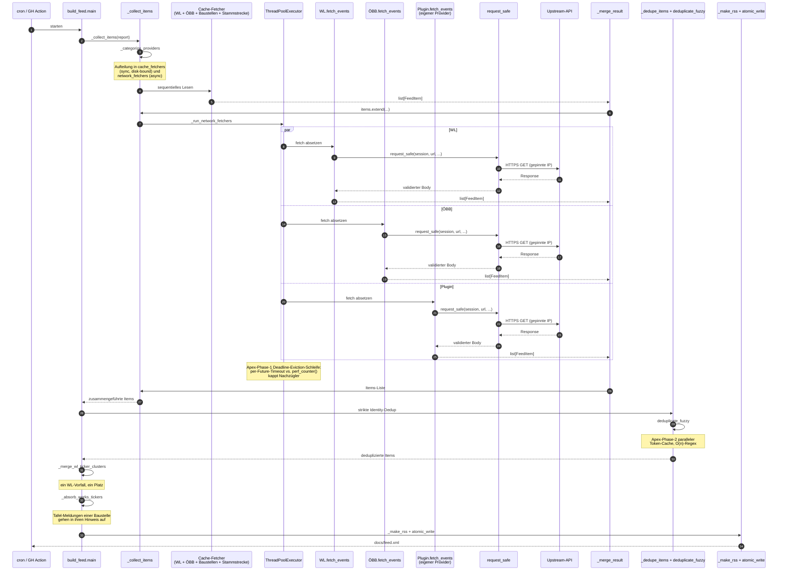
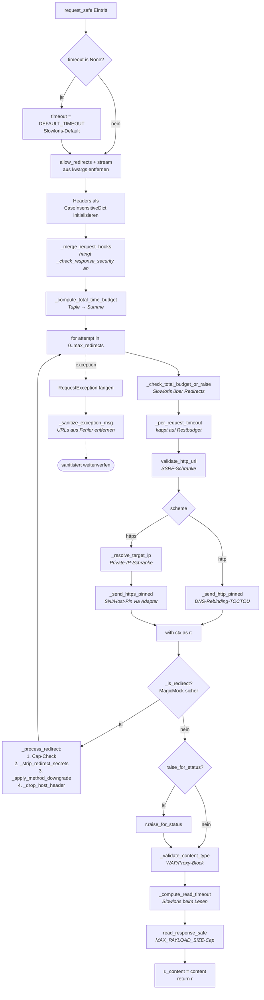
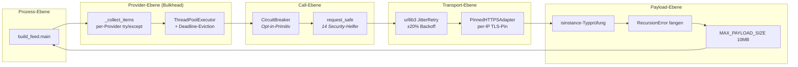
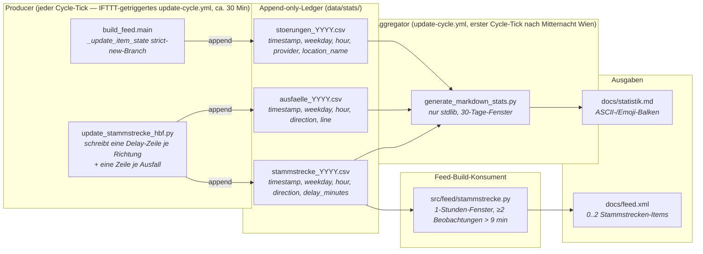
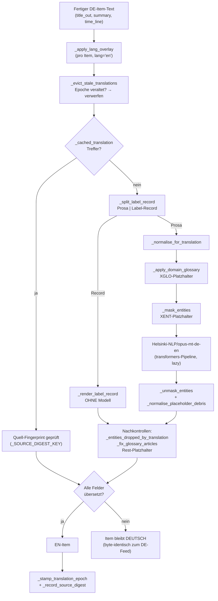

# Architektur-Karte — Wien ÖPNV Feed

Dieses Dokument ist die visuelle Ergänzung zur README. Es ist für
Entwickler:innen geschrieben, die in einem halben Jahr zum Projekt
stoßen: jene Person, die verstehen muss, **wie das System
zusammenhängt**, bevor sie sich in irgendeine einzelne Datei stürzt.

Die Diagramme weiter unten werden von GitHub automatisch gerendert.
Wer das hier in einem Viewer ohne Mermaid-Unterstützung liest, findet
zu jedem Diagramm dieselbe Information zusätzlich als Fließtext
darunter.

---

## 1. Die Pipeline für den Abruf der Verkehrsdaten

Der zentrale Workflow: Ein Cron-Job (bzw. die GitHub-Action
`update-cycle.yml`) startet `python -m src.cli feed build` (das wiederum
`build_feed.main()` aufruft), invokiert die registrierten
Verkehrsdaten-Provider, dedupliziert die zusammengeführten Events und
schreibt einen einzelnen RSS-Feed.

> **Hinweis zum aktuellen Default-Setup:** Das Diagramm illustriert
> beide Provider-Modi des Builders (sync cache vs. async network).
> Im aktuellen Cron-Setup (`update-cycle.yml`) werden die HTTP-Fetcher
> für WL, ÖBB und Baustellen aber **in eigenen Workflow-Steps** vor
> dem `feed build` ausgeführt und schreiben in `cache/<provider>/`;
> der Feed-Build selbst sieht alle Default-Provider (WL, ÖBB,
> Baustellen, Stammstrecke) deshalb als **cache_fetchers** (sync,
> disk-bound). Der Async-Pfad ist die Plug-in-Aufnahme-Stelle für
> nicht-cache-basierte Drittprovider — siehe §4.


```mermaid
sequenceDiagram
    autonumber
    participant Cron as cron / GH Action
    participant Build as build_feed.main
    participant Collect as _collect_items
    participant Cache as Cache-Fetcher<br/>(WL + ÖBB + Baustellen + Stammstrecke)
    participant Pool as ThreadPoolExecutor
    participant WL as WL.fetch_events
    participant OEBB as ÖBB.fetch_events
    participant Plug as Plugin.fetch_events<br/>(eigener Provider)
    participant Safe as request_safe
    participant Up as Upstream-API
    participant Merge as _merge_result
    participant Dedupe as _dedupe_items + deduplicate_fuzzy
    participant RSS as _make_rss + atomic_write

    Cron->>Build: starten
    Build->>Collect: _collect_items(report)
    Collect->>Collect: _categorize_providers
    Note over Collect: Aufteilung in cache_fetchers<br/>(sync, disk-bound) und<br/>network_fetchers (async)

    Collect->>Cache: sequentielles Lesen
    Cache-->>Merge: list[FeedItem]
    Merge->>Collect: items.extend(...)

    Collect->>Pool: _run_network_fetchers
    par WL
        Pool->>WL: fetch absetzen
        WL->>Safe: request_safe(session, url, ...)
        Safe->>Up: HTTPS GET (gepinnte IP)
        Up-->>Safe: Response
        Safe-->>WL: validierter Body
        WL-->>Merge: list[FeedItem]
    and ÖBB
        Pool->>OEBB: fetch absetzen
        OEBB->>Safe: request_safe(session, url, ...)
        Safe->>Up: HTTPS GET (gepinnte IP)
        Up-->>Safe: Response
        Safe-->>OEBB: validierter Body
        OEBB-->>Merge: list[FeedItem]
    and Plugin
        Pool->>Plug: fetch absetzen
        Plug->>Safe: request_safe(session, url, ...)
        Safe->>Up: HTTPS GET (gepinnte IP)
        Up-->>Safe: Response
        Safe-->>Plug: validierter Body
        Plug-->>Merge: list[FeedItem]
    end

    Note over Pool: Apex-Phase-1 Deadline-Eviction-Schleife:<br/>per-Future-Timeout vs. perf_counter()<br/>kappt Nachzügler

    Merge->>Collect: Items-Liste
    Collect-->>Build: zusammengeführte Items
    Build->>Dedupe: strikte Identity-Dedup
    Dedupe->>Dedupe: deduplicate_fuzzy
    Note over Dedupe: Apex-Phase-2 paralleler<br/>Token-Cache, O(n)-Regex
    Dedupe-->>Build: deduplizierte Items
    Build->>Build: _merge_wl_ticker_clusters
    Note over Build: ein WL-Vorfall, ein Platz
    Build->>Build: _absorb_works_tickers
    Note over Build: Tafel-Meldungen einer Baustelle<br/>gehen in ihren Hinweis auf
    Build->>RSS: _make_rss + atomic_write
    RSS-->>Cron: docs/feed.xml
```

**Warum jeder Schritt zählt:**

- **`_categorize_providers`** entscheidet, welche Provider synchron laufen können (Loader trägt das Attribut `_provider_cache_name` → liest von der Platte) und welche asynchron (echter Netzwerk-Abruf). Diese Trennung hält den Executor-Pool auf I/O-gebundene Arbeit fokussiert.
- **Der `par … and …`-Block** ist das **Bulkhead-Prinzip**: Ein Crash in einem einzelnen `fetch_events`-Aufruf wird von `_drain_completed_futures` abgefangen und als Fehler genau dieses Providers verbucht — die anderen laufen weiter. Genau das macht das System nie „komplett wegen einer kaputten Quelle aus".
- **Der Hinweis auf Apex-Phase-1** ist entscheidend: Ohne gedeckelte `wait()`-Timeouts würde die Schleife gegen `perf_counter()` busy-spinnen.
- **`request_safe`** ist die Security-State-Machine — siehe Diagramm §2.
- **`deduplicate_fuzzy`** ist Apex-Phase-2-Territorium: Der parallele `merged_cache` reduziert das O(n²)-Regex-Reparsing auf O(n).
- **Vor dem Altersfilter** verwirft `_drop_test_messages` Testmeldungen der Anbieter („Testmeldung“, oder ein Titel bzw. Text von höchstens fünf Wörtern mit dem Wort „Test“, wobei ein Bindestrich zum Wort gehört und „Test-Fahrten“ nicht trifft; Anlass: zwei WL-Testmeldungen am 23.09.2026). Sie belegten sonst einen der zehn Plätze.
- **Nach der Dedupe** legt `_merge_wl_ticker_clusters` die WL-Störungen eines Vorfalls zu einem Eintrag zusammen (seit 2026-09-26), und seit 2026-10-01 auch die einer Linie, deren Gültigkeit sich überschneidet (unten, „Titel und Beschreibung im deutschen Feed“). `deduplicate_fuzzy` lässt zwei WL-Störungen derselben Linien deshalb in Ruhe (`_may_merge`); WL-Störungen sich überschneidender, verschiedener Linien („40/41“ und „40“) führt es weiter selbst zusammen. Anschließend gehen die Anzeigetafel-Meldungen einer Baustelle in deren Hinweis auf (`_absorb_works_tickers`, seit 2026-10-02): eine WL-Störung mit genau einem Vorfall, deren Ursache der Hinweis im Titel oder in der `<h2>`-Überschrift nennt, deren Linien er abdeckt, deren Gültigkeit in seiner liegt (± 1 Tag) und von deren Straßen er eine nennt. Anlass: „D: Gleisbauarbeiten [Am 01.10.2026]“ für Arbeiten vom 28.09. bis 07.11., ebenso 12A, 25, N20, N49, 37A und 74A in allen 68 WL-Cache-Ständen vom 30.09. bis 02.10.; WL veröffentlicht die Tafel-Meldungen jede Nacht neu, sie belegten so täglich einen vorderen Platz. Die Straße hält zwei Baustellen derselben Ursache auseinander („66A: Busse halten Salvatorianerplatz“ ist nicht der Hinweis „65A/66A: Inzersdorfer Straße“). Den WL-Merge einfach vor `deduplicate_fuzzy` zu ziehen hätte die Reste auch entfernt, nahm aber am 02.10. einen Rettungseinsatz der Linie D mit in den Hinweis. Danach entscheidet die Reihenfolge, was die zehn Plätze bekommt: Sortierung nach `first_seen` (neueste zuerst; eine wiederkehrende WL-Meldung bekommt vorher über `_restart_recurring_occurrences` den Beginn ihres aktuellen Auftretens, die WL-GUID enthält kein Datum), dann `_defer_repeated_route_titles` (von wortgleichen ÖBB-Titeln bleibt nur das früheste Zeitfenster vorn), `_apply_topic_budget` (höchstens `MAX_ITEMS_PER_TOPIC` je Ursachenwort und Tag), `_defer_upcoming_items` (was erst nach `UPCOMING_PREVIEW_DAYS` Tagen beginnt, rückt hinter alles Laufende, Betreiberentscheidung 2026-10-02) und `_defer_all_clear_items` (ÖBB-Entwarnungen „Aufhebung …“ ganz nach hinten, Betreiberentscheidung 2026-09-25). Die Regeln löschen nichts, sie stellen hinter das Feld — siehe `docs/development.md`, „Reihenfolge im Feed".

### Titel und Beschreibung im deutschen Feed

Diese Regeln entscheiden, was ein Eintrag im deutschen Feed zeigt. Sie
laufen vor jeder Übersetzung; der EN-Feed übersetzt ihr Ergebnis (§8). Der
Feed läuft auf Info-Displays mit zehn Plätzen (`AGENTS.md`, „Priorität der
Ausgaben“): Ein Titel muss für sich stehen, und ein doppelter Eintrag
verdrängt eine andere Störung.

* **Ticker-Titel: Ursache oben, Folge darunter (seit 2026-09-25).** Bei
  einer WL-Störung behält der Titel nur Linie und Ursache, die Folge wandert
  an den Anfang der Beschreibung (`_finish_reason_title`):
  `14A: Rettungseinsatz` über `Betrieb ab Laxenburger Straße / Gudrunstraße
  [Am 25.09.2026]`. Die Ursache findet `_reason_and_fragment` auf zwei Wegen:
  über `_TITLE_REASON_WORDS` oder, für Ursachen außerhalb der Liste
  („Schadhafter Zug“, „Signalstörung“, „PKW im Gleis“), über den Anfang der
  Folge (`_CONSEQUENCE_START_RE`: „Betrieb ab/nur/über“, „Kein Betrieb“,
  „Züge/Busse halten“, „Umleitung“). Davor dürfen höchstens drei Wörter ohne
  Ziffer stehen. Nennt die Beschreibung die Folge schon, bleibt sie, wie sie
  ist. Wiederholt sie nur Ursache und Folge, ersetzt die Folge sie. Sonst
  steht die Folge vorn, und gekürzt wird hinter dem letzten passenden Satz
  (`_last_sentence_end`). Den Strich behalten Hinweise, deren zweite Hälfte
  ein Ort ist (`D: Gleisbauarbeiten – Althanstraße`), sowie Ticker, deren
  kurzer Titel unter den sichtbaren Items doppelt wäre. WL schickt zu einem
  Vorfall oft mehrere Ticker (`49: Gleisschaden`, `… Betrieb ab
  Urban-Loritz-Platz`, `… Betrieb ab Hütteldorfer Straße`), und drei gleiche
  Zeilen auf dem Display wären schlechter als drei lange
  (`_short_title_collisions`, entschieden in `_make_rss` für DE und EN
  gemeinsam). Trägt ein anderes sichtbares Item den kurzen Titel schon als
  eigenen, bleiben alle lang. Sonst wird der am höchsten platzierte Ticker
  kurz, die übrigen bleiben lang. Seit 2026-09-26 kommen solche Gruppen
  meist gar nicht mehr so weit (nächster Punkt).
* **Ein Vorfall, ein Platz (seit 2026-09-26, Betreiberentscheidung).** Am
  26.09. belegte die Linie 62 drei der zehn Plätze mit drei Tickern aus 86
  Sekunden („ÖBB Bauarbeiten Betrieb ab Kliebergasse“, „Züge halte bei
  Linie 18, Richtung Burggasse“, „ÖBB Bauarbeiten Kein Betrieb“). Rückschau
  über 693 Feed-Stände: 242 mit einer solchen Gruppe, zusammen 485 Plätze.
  `_merge_wl_ticker_clusters` legt WL-Störungen derselben Linien, die
  innerhalb von `WL_TICKER_CLUSTER_SECONDS` (600 s) nach der ersten
  erscheinen, zu einem Eintrag zusammen, nach der Duplikatprüfung und vor
  Sortierung und Platzvergabe (`main` und `lint`):
  - Ausführliche Meldung (seit 2026-09-27): Sagt eine ausführliche
    WL-Meldung der Gruppe mehr als den Standardsatz, steht sie mit Titel
    und Text für die Gruppe; die Kurzmeldungen belegen keinen eigenen
    Platz. Was Kurzmeldungen derselben Ursache (oder ohne Ursache)
    ankündigen und ihr Text nicht nennt, bleibt (`_with_consequences`, seit
    2026-10-01, Regeln unten bei „Eine Linie, ein Platz“). „Betrieb ab
    Mühlbreiten“ der 64A vom 01.10. stand sonst nirgends: „64A:
    Verkehrsunfall“ über „Betrieb ab Mühlbreiten. Unregelmäßige Intervalle
    in beiden Richtungen. Grund: Verkehrsunfall.“ Eine Kurzmeldung anderer
    Ursache bleibt draußen. Erkannt wird sie an ihren Sätzen
    (`_is_long_message`: Der Text endet mit einem Punkt; im WL-Cache vom
    September gilt das für alle 504 Texte in Sätzen und für keine der 247
    Kurzmeldungen). Das Präfix „Linie 48A:“ taugt dafür nicht, weil
    `_post_filter_wl` es beim Lesen des Caches entfernt und manche
    Meldungen es nie hatten. Anlass: Am 27.09. stand „48A: Falschparker“
    über „Grund: Fremder Verkehrsunfall“, und angehängte Kurzmeldungen
    schoben den zweiten Satz einer ausführlichen Meldung über die
    180 Zeichen.
  - Kurzmeldungen außerhalb des Fensters (seit 2026-10-01): Sie kommen
    über „Eine Linie, ein Platz“ (unten) zu ihrer ausführlichen Meldung
    und behalten, was sie zusätzlich sagen. Anlass: Am 30.09. kamen die
    Kurzmeldungen der Linie D um 04:00, die ausführliche Meldung um 04:30;
    „D: Gleisbauarbeiten“ stand bis zum 01.10. zweimal im Feed. Jetzt
    steht dort einmal „Kein Betrieb zwischen Börse und Augasse; Züge
    halten in Schleife, Wipplingerstr 39. Weichen Sie …“. Bei der 48A kam
    die Kurzmeldung um Mitternacht neu, die ausführliche Meldung um 21:47;
    jetzt steht „Shuttlebus eingerichtet, Abfahrtsstelle: Haltestelle
    Linie 46!“ hinter ihrer Maßnahme. Bis zum Abend des 01.10. verwarf
    eine eigene Zuordnung zur ausführlichen Meldung diese Kurzmeldungen
    samt ihrem Inhalt.
  - Sonst ist der Titel Linie und die häufigste Ursache der Gruppe; ohne
    Ursache der Titel der ersten Meldung. Die Ursache kommt aus dem Titel
    (`_reason_and_fragment`), aus einer ausführlichen Meldung mit dem
    Standardsatz oder aus der ersten Zeile der Tafel („Gleisbauarbeiten /
    Betrieb ab Johnstraße U“).
  - Beschreibung: alle Folgen in der Reihenfolge, in der WL sie
    veröffentlicht hat, mit „;“ zu einem Satz verbunden, weil die
    Beschreibung höchstens zwei Sätze übernimmt. Eine andere Ursache behält
    WLs Wortlaut („Fahrtbehinderung wegen Rettungseinsatz“). Was der Titel
    oder eine andere Meldung der Gruppe schon sagt, fällt weg; WLs
    Standardsatz „Nach einer Fahrtbehinderung …“ weicht allem Konkreten.
    Folgen mit denselben zwei ersten Wörtern nennen diese einmal
    (`_shared_openings`, seit 2026-10-01): „Busse halten Bessemerstraße 1-3,
    auf Hauptfahrbahn, Hoßplatz 11“. Eine Folge mit eigenem Komma bleibt für
    sich, sonst läse sich ihr zweiter Teil als weitere Haltestelle.
  - Der Eintrag behält GUID, Identität und Beginn der zuerst
    veröffentlichten Meldung und bekommt das späteste Ende; ein offenes Ende
    bleibt offen. Nicht der früheste Beginn: WL verwendet manchmal eine alte
    Tafel-Meldung für einen neuen Vorfall, und am 27.09. stand deshalb
    „23.09.2026 – 27.09.2026“ über einem Schaden vom selben Morgen.
  - `62: ÖBB Bauarbeiten` über „Betrieb ab Kliebergasse; Züge halte bei
    Linie 18, Richtung Burggasse; Kein Betrieb.“
  - Grenzen: Andere Linienmengen („62/18“), Hinweise und andere Quellen
    bleiben getrennt. Die Beschreibung ist auf 180 Zeichen begrenzt. Die
    Störungsstatistik zählt einen zusammengelegten Vorfall einmal.
  - Eine Ausnahme bei den Linienmengen (seit 2026-10-02): Zwei
    Kurzmeldungen verschiedener Linien mit gleichem Titeltext und gleichem
    Text im selben Fenster verbinden ihre Gruppen (`_join_twin_groups`).
    Der Eintrag steht unter allen Linien; eine Folge, die nur ein Teil der
    Linien meldet, behält deren Kürzel. Anlass: Am 02.10. um 01:00:12 kam
    „Busse halten Laxenburger Straße 66“ für N65 und für N66 und belegte
    zwei der zehn Plätze. Jetzt steht dort „N65/N66: Bauarbeiten“ über
    „Busse halten Laxenburger Straße 66; N66: Busse halten
    Salvatorianerplatz.“ Gruppen mit ausführlicher Meldung bleiben getrennt.
* **Eine Linie, ein Platz (seit 2026-10-01, Betreiberentscheidung).**
  „Wenn mehrere unterschiedliche Linien betroffen sind, soll die Störung
  auch angezeigt werden. Mehrere Störungsmeldungen zur selben Linie sollte
  so gut wie möglich zusammengefasst werden.“ Anlass: Am 01.10. stand
  „60: Schadhafter Pkw & Schadhafter Pkw Betrieb ab Anschützgasse“ im Feed.
  `deduplicate_fuzzy` hatte zwei Kurzmeldungen der Linie 60 vor der
  WL-Zusammenlegung mit „&“ verbunden (21 solche Titel seit 12.09.). Und
  „66A: Rettungseinsatz“ stand neben „66A: Busse halten
  Salvatorianerplatz“. Seit 27.09. hatten 112 von 236 Feed-Ständen eine
  Linie in mehr als einem Eintrag.
  - Nach den Fenstern legt
    `_merge_wl_ticker_clusters` die WL-Störungen derselben Linien
    zusammen, deren Gültigkeit sich überschneidet, auch über mehrere
    Schritte (`_line_runs`).
  - Eine Ursache: ein Vorfall, wie oben zusammengelegt. Beispiel: Die vier
    Kurzmeldungen der Linie 18 vom 01.10. kamen um 16:25, 16:31, 16:33 und
    16:37, über das 10-Minuten-Fenster hinaus. Steht eine ausführliche
    Meldung darin, steht sie für den Vorfall, von mehreren die neueste
    (`_incident_entry`). Was die übrigen Kurzmeldungen ankündigen und ihr
    Text nicht nennt, bleibt (`_with_consequences`), nach diesen Regeln:
    - Was Fahrgäste tun müssen („Kein Betrieb“, „Betrieb ab/nur/…“, „Züge
      halten“, „Busse halten“, „Umleitung“, „Ersatzbus“, „Shuttlebus“,
      „Einstieg“, „benützen“, „ausweichen“), steht vorn. Nennt der Text
      selbst eine Maßnahme, hängt es mit „; “ an deren Satz, vor „Weichen
      Sie …“ und vor „Voraussichtliche Dauer“. Beispiel 60 am 22.09.:
      „Betrieb nur zwischen Westbahnhof S U und Hofwiesengasse; Züge halten
      bei der Linie 62 Fahrtrichtung Lainz. Weichen Sie …“. Ein eigener
      Satz ginge verloren, wenn die Kurzmeldung auf eine Hausnummer endet:
      Hinter „Wipplingerstr 39.“ erkennt die Zusammenfassung keine
      Satzgrenze und nahm bei der Linie D samt der Folge auch „Weichen Sie
      …“ mit. Ohne eigene Maßnahme steht es als erster Satz davor; so
      stehen die Haltestellen des Ersatzbusses 26E seit dem 25.09. neben
      „26E: Gleisbauarbeiten“ („Die Kapazitäten der Ersatzlinie 26E …“)
      und wären sonst verschwunden.
    - Was Fahrgästen nichts zu tun gibt („Derzeit längere Wartezeiten!“),
      kommt ans Ende. Vorn nahm es bei der N29 am 30.09. den zweiten Satz
      der Zusammenfassung und damit die Ursache.
    - Ein bloßes „Fahrtbehinderung“ hängt nie an. Als gesagt gilt eine
      Folge, deren Wörter ab vier Buchstaben der Text schon hat („Betrieb
      ab Hofwiesengasse“ neben „Betrieb nur zwischen Westbahnhof S U und
      Hofwiesengasse“). Eine längere oder kürzere Form zählt ab fünf
      Buchstaben mit („Verspätung“ in „Verspätungen“). Verneinungen zählen
      nicht als Wort: „Kein Betrieb“ ist neben „Derzeit ist ein Betrieb
      nicht möglich“ gesagt (1A am 22.09.).
    - Eine vorangestellte Ursache („Gasrohrgebrechen Shuttlebus …“) und
      WLs Tafel-Auszeichnung („\*\*Umleitung\*\*“) fallen weg.
  - Gleiche Ursache heißt auch WLs Synonym (`_CAUSE_SYNONYMS`): Im selben
    Fenster schrieb WL seit September 14-mal „Schadhafter Zug“ neben
    „Schadhaftes Fahrzeug“, 9-mal „Fremdunfall“ oder „Verkehrsunfall“ neben
    „Fremder Verkehrsunfall“, 6-mal „Beschädigte Oberleitung“ neben
    „Oberleitungsgebrechen“. Nur was WL so nebeneinander schrieb:
    „Bauarbeiten“ und „Gleisbauarbeiten“ können zwei Baustellen sein
    („12A: Bauarbeiten, Gleisbauarbeiten“ über „Bauarbeiten: Busse halten
    Linke Wienzeile 110. Gleisbauarbeiten: Betrieb ab Johnstraße U,
    Schweglerstraße 19-21.“).
  - Mehrere Ursachen: ein Eintrag, der jede nennt, der neueste Vorfall
    zuerst und mit dessen GUID, damit ein neuer Vorfall den Feed weiter
    anführt (`_combined_incidents`). Je Vorfall ein Satz „Ursache: Folge.“
    (`_incident_sentences`). Das ist die Maßnahme, mit der die
    ausführliche Meldung beginnt, vor „Weichen Sie …“, „Voraussichtliche
    Dauer“ und „Grund:“ (`_LONG_MESSAGE_TAIL_RE`; die Satztrennung sieht das
    Satzende hinter „Stephansplatz U.“ nicht). Sie sagt mehr als die Tafel
    („Betrieb nur zwischen St. Marx S und Landstraße S U“ statt „Betrieb ab
    Landstraße“). Dahinter steht die Folge der Tafel, wenn sie Neues sagt
    („Busse halten bei der Linie 14A“); ein bloßes „Fahrtbehinderung“ sagt
    nichts Neues, und WLs Standardsatz weicht der Folge. Ohne ausführliche
    Meldung ist es die Folge der Tafel. Eine Ursache ohne Folge, oder mit
    dem Standardsatz neben etwas Konkretem, nennt nur der Titel. Über 180 Zeichen gibt die längste
    Angabe zuerst ihre letzte Folge ab. Ein solcher Titel gilt nicht als
    Kurzmeldung (`_is_wl_ticker`), wird also nicht in Ursache und Folge
    geteilt:

    ```
    66A: Rettungseinsatz, Bauarbeiten
    Rettungseinsatz: Unregelmäßige Intervalle in beiden Richtungen. Bauarbeiten: Busse halten Salvatorianerplatz. [01.10.2026 – 02.10.2026]
    ```

  - Eine Meldung ohne eigene Ursache geht zum Vorfall, der ihr zeitlich
    am nächsten veröffentlicht wurde.
  - Ausnahmen: Eine Ursache von mehr als `_MAX_LISTED_WORDS` (6) Wörtern
    ist ein Satz. Die Meldung „18: Haltestelle Stadionbrücke … aufgelassen.
    Bitte …“, seit Juli im Cache, behält ihren Eintrag und schließt sich
    keinem Vorfall an. Verschiedene Linienmengen bleiben getrennt, auch
    bei gleicher Ursache („1A: Demonstration“, „3A: Demonstration“).
    Vorfälle ohne gemeinsame Gültigkeit bleiben getrennt.
  - Grenzen: Die Beschreibung übernimmt zwei Sätze; bei drei Ursachen mit
    eigener Folge nennt nur der Titel die dritte. Erscheinen zwei Vorfälle
    im selben Lauf zum ersten Mal, zählt die Störungsstatistik nur den
    neueren.
  - Rückschau über 750 Cache-Stände seit 12.09. (Kurzmeldungen, ÖBB und
    Baustellen, nur Duplikatprüfung und Zusammenlegung): 1.727 Einträge
    weniger. In keinem Stand stehen mehr Einträge als vorher. Paare
    derselben Linie: 4.931 statt 6.958. WL-Titel mit „&“: 126 statt 292. Die
    126 sind ein Hinweis der 63A vom 15. bis 17.09., den `deduplicate_fuzzy`
    mit einer Störung verband.
* **„Fahrtbehinderung <Ursache>“ (seit 2026-09-25).** WL setzt die Art der
  Behinderung vor die Ursache („11A: Fahrtbehinderung Verkehrsunfall“,
  „31: Fahrtbehinderung wegen Polizeieinsatz“; 106 Titel seit Juni).
  Betreiberentscheidung (Audit A.13): Die Ursache kommt in den Titel
  („11A: Verkehrsunfall“), „Fahrtbehinderung“ füllt eine sonst leere
  Beschreibung. Eine eigene Beschreibung von WL bleibt unverändert, weil sie
  mehr sagt (`_HINDRANCE_RE` in `_reason_and_fragment`). Folgt auf die
  Ursache noch eine Folge, gewinnt die Folge die Beschreibung. Die lange
  Form bei Kollisionen lautet `18: Fahrtbehinderung – Verkehrsunfall`;
  „fahrtbehinderung“ steht dafür in `_INCIDENT_REASON_WORDS`.
* **„ÖBB-Ersatzbus für <80“ (seit 2026-09-25).** Die Anzeigetafeln der WL
  zeigen das S-Bahn-Logo als Zeichen, das in den Daten als „<“ ankommt.
  Die Meldung „Bhf. Hütteldorf / ÖBB-Ersatzbus für <80“ kam täglich mit
  `relatedLines` „1“ und erschien als „1: Bhf. Hütteldorf ÖBB-Ersatzbus für
  80“. Die Straßenbahn 1 fährt nicht nach Hütteldorf; gemeint ist die S80.
  `_attribute_obb_replacement_bus` (in `_post_filter_wl`) setzt die
  S-Bahn-Linie aus dem Text als Linie ein und legt den Ort in die
  Beschreibung: `S80: ÖBB-Ersatzbus` über „Bhf. Hütteldorf“. Das gilt nur für
  die Wiener S-Bahn-Nummern (1, 2, 3, 4, 7, 40, 45, 50, 60, 80).
* **Kein Titel aus Liniennummern (seit 2026-10-01).** WL betitelte den
  Hinweis zur Demonstration am 01.10. mit „D, 1, 2, 71, 1A, 3A“; im Feed
  stand „D/1/2/71/1A/3A: D, 1, 2, 71, 1A, 3A“. Besteht ein Titel nur aus
  Linien, nimmt `_title_or_heading` die Überschrift der Beschreibung
  (`<h2>Demonstration</h2>`), ungekürzt: `_tidy_title_wl` hielte
  „Gleisbauarbeiten“ vor einem Ort für ein Etikett. Ohne Überschrift bleibt
  der Titel.
* **ÖBB-Strecken von einem Knoten (seit 2026-10-01).** Nennt eine Meldung
  drei oder mehr Strecken, die alle an einem Bahnhof beginnen, steht der
  Bahnhof einmal vorn (`_try_star_routes`): „R 40/REX 41/REX 4/S 40: Wien
  Franz-Josefs-Bahnhof ↔ St.Andrä-Wördern / Tulln an der Donau / Wien
  Heiligenstadt / Wien Nußdorf“ statt viermal „Wien Franz-Josefs-Bahnhof ↔
  …“. Strecken, die eine Kette bilden, bleiben eine Kette
  (`_try_chain_routes`).
* **ÖBB: Teilstrecken gehen in der Gesamtstrecke auf (seit 2026-10-02).**
  Liegt eine Strecke einer Meldung ganz auf einer anderen derselben Meldung,
  nennt der Titel nur die längere (`_drop_contained_routes`). Ein Bahnhof
  liegt „auf dem Weg“, wenn der Umweg über ihn höchstens 20 % länger ist als
  die Luftlinie (`_CORRIDOR_DETOUR_FACTOR`) und eine ÖBB-Linie alle drei
  Bahnhöfe bedient (`station_lines`, aus `data/oebb_station_lines.json`).
  So wurde der Titel oben (125 Zeichen) zu „R 40/REX 41/REX 4/S 40: Wien
  Franz-Josefs-Bahnhof ↔ Tulln an der Donau“ (70) und „REX 50/REX 51/S 50:
  Wien Hütteldorf ↔ Wien Westbahnhof ↔ St. Pölten Hauptbahnhof“ zu „… Wien
  Westbahnhof ↔ St. Pölten Hauptbahnhof“. Die Linienbedingung hält
  Flughafen Wien neben Bruck an der Leitha im Titel, obwohl er auf der
  Luftlinie dazwischen liegt. Die einzelnen Strecken stehen weiter in der
  Beschreibung. In 441 ÖBB-Cache-Ständen der Historie änderte das 11 Titel
  und keine Zahl der Einträge nach `deduplicate_fuzzy`.
* **Anzeigelänge des Titels (seit 2026-10-02).** Über 50 Zeichen
  (`_DISPLAY_TITLE_TARGET`; zuerst 70, auf Betreiberwunsch gesenkt: im Feed
  vom 02.10. Median 33, drei Viertel ≤ 41) wird ein Titel an seinen eigenen Fugen gekürzt,
  nie abgeschnitten. Das geschieht erst beim Rendern (`_display_title` in
  `_format_item_content`), nach Dedupe und Merges, die Titel vergleichen:
  Früher gekürzt, las sich „18: Haltestelle Stadionbrücke aufgelassen“ wie
  eine kurze Ursache, und `_line_runs` legte die Meldung mit „18:
  Gleisschaden“ zusammen.
  * WL: Ein Titel aus ganzen Sätzen behält den ersten Satz, und ist der
    noch zu lang, fällt dessen Begründung („im Rahmen …“, „zur …“,
    „wegen …“) vor dem Partizip weg (`_shorten_wl_sentence_title`): „18:
    Haltestelle Stadionbrücke aufgelassen“ statt
    137 Zeichen. Nur wenn die Beschreibung jedes weggenommene Wort enthält;
    sie erscheint dann vollständig, weil sie den Titel nicht mehr wiederholt.
  * Baustellen: Im Abschnitt „von … bis …“ fällt zuerst „Kreuzung“ weg, dann
    jeder zweite Name an einem Ende (`_compact_baustellen_section`): „U2:
    Rechte Wienzeile von Ramperstorffergasse bis Pilgramgasse“ statt „… von
    Kreuzung Ramperstorffergasse bis Kreuzung Pilgramgasse und
    Pilgrambrücke“. Ist der Titel dann noch über 50, behält er die Straße,
    und der Abschnitt steht vor dem ersten Satz der Beschreibung
    (`_baustellen_display`): „Landstraßer Hauptstraße“, darunter „Von
    Emmerich-Teuber-Platz und Juchgasse und Apostelgasse bis
    Schlachthausgasse: Es wird …“. Hätten zwei sichtbare Baustellen dann
    denselben Titel, behalten beide den Abschnitt (`_section_collisions`).
  * WL: „ab 07. April 2026“ am Titelende fällt weg, wenn die Meldung einen
    Beginn hat; die Zeitzeile nennt ihn. Die Ziffernform „ab 14.09.26“ fiel
    schon beim Abruf weg.
  * Bewusste Ausnahmen über 50: ÖBB-Strecken mit mehreren Linien („R40/REX41/
    REX4/S40: Wien Franz-Josefs-Bahnhof ↔ Tulln an der Donau“, 66) und
    „66A/N66: Grenzackerstraße Richtung Reumannplatz bzw. Oper, Karlsplatz“
    (69), deren Richtung sie von der Gegenrichtung „66A/N66:
    Grenzackerstraße“ unterscheidet.
* **Linien und Hausnummern im Titel (seit 2026-10-02).** Ebenfalls beim
  Rendern (`_display_title`):
  * ÖBB: Die Linienliste vor dem Doppelpunkt steht ohne Leerzeichen
    (`_compact_line_prefix`): „R40/REX41/REX4/S40: …“ statt „R 40/REX 41/REX
    4/S 40: …“, wie WL („U6“) und der Stammstrecken-Monitor („S1/S2“). Die
    Beschreibung bleibt im Wortlaut der ÖBB (Betreiberwunsch).
  * Baustellen: Hausnummern stehen als Adresse (`_mark_house_numbers`).
    „Rennweg von 33A bis 37“ las sich am Fernseher wie Bus 33A und
    Straßenbahn 37; jetzt „Rennweg 33A–37“, ebenso „Kirchengasse 1–30“. Eine
    einzelne Nummer an einem Abschnittsende wird „bis Nr. 44“.
* **ÖBB: alle betroffenen Linien vorn (seit 2026-10-01).** Das Präfix
  nennt jede Linie, die die Beschreibung als ausfallend nennt („keine R
  40-Züge“, „die REX 41-Züge … können nicht fahren“), in ihrer Reihenfolge
  und jede einmal (`_affected_lines`). Bis dahin stand nur die erste davon
  vorn, und `R` kannte das Muster nicht: Über „… keine R 40-Züge fahren“
  stand „REX 41: …“, die zweite von vier Linien. Im ÖBB-Cache seit September
  nannten 3 von 45 Meldungen mehrere Linien; eine nannte nur die R 95 und
  hatte kein Präfix. Ausweichverbindungen der Wiener Linien („Linie U4“)
  stehen ohne „-Züge“ und zählen nicht. `_extract_line_prefix` erkennt ein
  solches Präfix wieder, sonst setzte `_post_filter_oebb` es beim Lesen des
  Caches ein zweites Mal davor.

* **Absatzende ist Satzende (seit 2026-10-02).** WL baut ausführliche
  Meldungen aus Absätzen und Überschriften. Die Umwandlung in Text machte
  aus jeder Grenze ein Leerzeichen, und Überschrift und Felder liefen
  ineinander: „U1: Starke Nachfrage Die U1 wird …“, „… Schwedenplatz U
  Haltestelle: Stammersdorf Von: Brünner Straße gegenüber 262 …“
  (16 von 69 Meldungen am 02.10.). `html_to_text(mark_block_ends=True)`
  markiert jetzt das Ende jedes Absatzes, und `_close_blocks` setzt dort
  den Punkt, der fehlt. Eine erste Überschrift, deren Wörter alle schon im
  Titel stehen („Bauarbeiten S80“ unter „S80: Bauarbeiten“), fällt weg; ein
  einzelnes Wort (`<h2>Gleisbauarbeiten</h2>`) bleibt den bisherigen
  Regeln, und eine Überschrift ohne Text dahinter bleibt stehen. Zwei
  Ausnahmen vom Punkt: Endet ein Absatz auf ein Funktionswort („… der damit
  einhergehenden“) oder beginnt der nächste klein („prov. Einbahnführung
  …“), läuft der Satz weiter; ein Etikett mit Doppelpunkt („Maßnahmen:“)
  gehört zum nächsten Absatz und steht nie allein am Ende. Absätze mit
  „Zeitraum:“ und „Dauer:“ fallen in jedem mehrteiligen Text weg, denn die
  Zeitzeile nennt die Daten schon, und sie nahmen den Maßnahmen den Platz.
  Beginnt der Text mit einer Überschrift oder einem Feld, gilt die
  Zwei-Sätze-Regel nicht, sonst stünde „Haltestelle: Stammersdorf.“ ohne
  die neue Lage da: gezeigt werden die Felder bis zum ersten ganzen Satz,
  danach greift die 180-Zeichen-Grenze. Die Folge einer Kurzmeldung steht
  immer als Satz mit Punkt da („Busse halten bei Haltestelle N71.“), und
  ein doppelter Punkt aus der Quelle („umgeleitet..“) wird einer.
* **Verklebte Wörter (seit 2026-10-02).** Die Baustellentexte der Stadt
  Wien kamen mit Wörtern ohne Leerzeichen in den Feed („Derlinke
  Fahrstreifen“, „Außerhalbder Arbeitszeit“, „zuden“). Zwei Stellen: Der
  Cache-Schreiber (`scrub_trojan_source_primitives`) und `_sanitize_text`
  löschten Zeilenumbruch-Steuerzeichen (vertikaler Tab, U+2028 …) ersatzlos;
  sie werden jetzt zu einem Leerzeichen. Ob die Quelle selbst schon
  verklebt liefert, lässt sich aus der Sandbox nicht prüfen (kein Zugriff
  auf `data.wien.gv.at`); deshalb erkennt `repair_glued_words` die Form
  auch im Text: Artikel vor Fahrstreifen-Adjektiv, Präposition vor Artikel,
  Funktionswort hinter „-straße/-gasse/-stelle/-platz/-ung“. Über 16 362
  Texte aus Feed- und Cache-Historie trifft die Regel 23 Stellen, alle
  verklebt; „zudem“, „indem“, „beiden“, „derzeit“ bleiben ganz.
* **St.-Abkürzung, Leerzeichen vor Satzzeichen, Ortsangabe ohne Ort (seit
  2026-10-03).** Die Nachprüfung der Änderungen vom 02.10. rendert alle
  2.126 verschiedenen Meldungen der Cache-Historie neu und fand drei
  Formen übrig. ÖBB schreibt „St.Pölten Hbf“ ohne Leerzeichen, während der
  Titel derselben Meldung „St. Pölten Hauptbahnhof“ hieß;
  `repair_saint_abbreviation` setzt es in Titel und Text („St.“ vor
  Großbuchstabe, sonst nichts). Ein Leerzeichen vor Komma oder Semikolon
  („Betrieb ab Enkplatz , Grillgasse“) fällt in `_format_item_content` vor
  jedem Vergleich weg, sonst unterschieden sich Titel-Folge und Text und
  derselbe Satz stand zweimal; ein Leerzeichen vor einem Punkt („12:15
  Uhr .“) und „im Bereich .“ ohne Ort fallen aus der Beschreibung.
* **Zeitzeile: was für heute zählt (seit 2026-10-02, Betreiberentscheidung).**
  Wer vor dem Display steht, fragt: Gilt das jetzt, und wie lange noch?
  `format_local_times` antwortet darauf statt mit zwei vollen Daten:
  „[Heute]“ (endet heute), „[Bis Sa 03.10.]“ (läuft, der vergangene Beginn
  zählt nicht), „[Seit 30.09.]“ (läuft ohne Ende), „[Am So 04.10.]“ (ein
  künftiger Tag), „[Ab Mo 05.10. bis 11.11.]“ (beginnt später). Das Jahr
  steht nur, wenn es nicht das laufende ist, der Wochentag nur in den
  nächsten sieben Tagen. Eine Uhrzeit für das Ende steht bewusst nicht da
  (den Beginn einer Störung nennt der nächste Punkt): In den
  40 WL-Cache-Ständen bis 02.10. endeten 18 von 44 Störungen mit einer
  Uhrzeit am selben Tag genau eine Stunde nach ihrem Beginn („42:
  Feuerwehreinsatz“ 19:10 bis 20:10). Das sieht nach WLs Standardwert aus,
  nicht nach einer Prognose. Datum und Wochentag sind immer die realen des
  Kalenders nach Wiener Zeit (Europe/Vienna): Ein Ende am 03.10. um 01:00
  heißt „Bis Sa 03.10.“. Eine Verschiebung auf den Betriebstag davor (#1927)
  hat der Betreiber am 2026-10-02 verworfen. Ein sehr fernes Ende (mehr als `ABSOLUTE_MAX_AGE_DAYS` nach heute
  bzw. nach einem künftigen Beginn) fällt weg; gemessen ab dem Beginn verlor
  „N8: Thaliastraße U“ (seit 24.07.2024) sein Ende 16.11.2026. Der EN-Feed
  tauscht die Wörter einzeln aus (`_TIME_WORDS_DE_TO_EN`: „[From Mon 05.10.
  until 11.11.]“), die Daten bleiben. `ext:starts_at` und `ext:ends_at`
  ändern sich nicht.
* **Zeitzeile einer Störung: „[Seit 10:37]“ (seit 2026-10-03,
  Betreiberwunsch „Störung bitte mit Zeitangabe“).** Bei einer Störung will
  der Leser abschätzen, wie alt die Meldung ist. `_incident_since` liefert
  den Beginn einer ungeplanten Störung (Kategorie „Störung“: WL-`trafficInfos`,
  ÖBB, Stammstrecke), `format_local_times` zeigt ihn als Uhrzeit, wenn er
  heute liegt und die Störung heute endet oder kein Ende hat. Sonst bleiben
  die Zeilen oben.
  - **WL:** Ein Eintrag bündelt oft mehrere WL-Meldungen desselben
    Einsatzes: `pubDate` ist die früheste, `starts_at` die jüngste
    (`wl_fetch` nimmt die jüngste, damit eine wiederverwendete alte
    Kurzmeldung nichts zurückdatiert). Am 03.10. trugen „86A/87A/95A:
    Fahrtbehinderung wegen Rettungseinsatz“ `pubDate` 10:37:00, die von WL
    eingetragene Minute, und die Kurzmeldungen der Linien von 10:42:44 bis
    10:54:13 als `starts_at`. Der Beginn ist daher `pubDate`, wenn es am
    selben Wiener Tag liegt und nicht auf einer vollen Stunde; sonst
    `starts_at`. Von den 18 Bündeln seit Juli, deren früheste Meldung mehr
    als eine Stunde vor der jüngsten lag, trugen 12 eines dieser Merkmale,
    alle aus einem alten Stand („10A: Fahrtbehinderung“ mit 09.07. 00:00:25
    am 11.07.); bei den übrigen dürfte die früheste Meldung der echte
    Beginn sein („66A: Feuerwehreinsatz“ 13:43:00, jüngste Meldung
    15:06:30). Vorab eingetragene Maßnahmen schaltet WL zur vollen Stunde
    ein, wenige Sekunden später („12: Betrieb ab Franz-Josefs-Bahnhof“
    04:00:16), ohne dass der Titel die Ursache nennt; ein Beginn auf einer
    vollen Stunde zeigt deshalb keine Uhrzeit. Ein Einsatz, der zufällig zur
    vollen Stunde beginnt, zeigt weiter „[Heute]“. Die Beginne passen zur
    Beobachtung: 2 038 der 2 324 WL-Störungen seit Juli tauchten binnen 35
    Minuten nach ihrem `starts_at` im Feed auf (Takt 30 Minuten).
  - **ÖBB:** `starts_at` ist die Minute, in der ÖBB die Meldung
    veröffentlicht hat. Baustellen beginnen um 00:00 (reines Datum) und
    heißen „Bauarbeiten“. ÖBB meldet eine beendete Störung in der
    Vergangenheit („Wegen eines Polizeieinsatzes waren in Mödling Bahnhof
    bis 19:55 Uhr keine Fahrten möglich“, veröffentlicht 19:57) oder als
    „Aufhebung …“ (`_is_all_clear`); 60 der 193 ÖBB-Störungen seit Juli.
    Sie behalten ihre Zeile (`_reports_past_disruption`), „[Seit 19:57]“
    behauptete das Gegenteil.
  - **Stammstrecke:** Der Beginn ist die erste gemessene verspätete
    Abfahrt, auch zur vollen Stunde (`_MEASURED_SOURCES`). Die Beschreibung
    trägt kein eigenes „[Seit …]“ mehr; sie las sich „… in Richtung
    Praterstern [Seit 09.08.2026]“ über der Zeitzeile „[Seit 09.08.2026]“.
  - **Geplant** heißt `_PLANNED_DISRUPTION_RE` in Titel oder Beschreibung:
    Veranstaltung, Demonstration, Kundgebung, „…arbeiten“, Staatsbesuch,
    „…übung“, „…verlegung“, Netzänderung, die geplanten Ursachen unter den
    WL-Störungen seit Juli. Stadt-Wien-Baustellen sind keine Störungen.

### Zeitraum einer WL-Meldung: Plausibilitätsprüfung (seit 2026-10-02)

Wiener Linien nennen den Zeitraum einer Meldung bis zu dreimal: in
`time.start`/`time.end`, als „ab“/„am“-Datum im Titel und im Abschnitt
„Zeitraum:“ der Beschreibung. Ein Tippfehler steht meist nur an einer
Stelle. Anlass: „47B: Laufveranstaltung am 04.10.2027“ (Text und `time.end`:
04.10.2026) schob den Beginn ein Jahr hinter das Ende, der deutsche Feed
zeigte „[Ab 04.10.2027]“ für einen Lauf am selben Sonntag.

`src/providers/wl_plausibility.py` wägt die Angaben gegeneinander ab, in
dieser Reihenfolge:

1. **Mehrheit bei Widerspruch.** Titel- und Textdatum mit gleichem Tag und
   Monat, aber anderem Jahr: Es gilt das Jahr näher an der Veröffentlichung
   (`year_conflict`).
2. **Harte Grenzen.** Ein Beginn nach dem Ende wird vom Ende überstimmt
   (`begin_after_end`). Ein Beginn mehr als 365 Tage nach der
   Veröffentlichung zählt nur, wenn eine zweite Angabe ihn bestätigt
   (`unconfirmed_lead`). Längster echter Vorlauf im Cache vom 02.10.: 88
   Tage (Stammstrecke Phase 2).
3. **Im Zweifel konservativ.** Was offen bleibt, fällt auf `time.start`
   zurück. Eine Meldung wird wegen eines Widerspruchs nie versteckt; ein
   `time.start` nach `time.end` wird nur gemeldet
   (`source_start_after_end`).
4. **Jede Korrektur wird gesammelt.** Sie steht als Warnung im Log, und
   `scripts/update_wl_cache.py` führt sie in
   `data/wl_plausibility_anomalies.json` (gleiches Format wie
   `data/feed_line_anomalies.json`: `kind`, `title`, `detail`,
   `first_seen`, `last_seen`, `days_seen`). Die Datei entsteht erst mit der
   ersten Korrektur.

Die bisherigen Regeln gelten unverändert und zählen nicht als Korrektur:
Ein 11:11-Ende weicht dem Ende aus „Zeitraum:“, ein Beginndatum verschiebt
den Start nur nach hinten, und ein Textdatum hinter dem Ende ist das Datum
einer späteren Phase. Was die Prüfung nicht sehen kann: eine Angabe, die an
allen Stellen gleich falsch ist.

Nennt „Zeitraum:“ kein Ende, sondern eine Dauer („auf Dauer von etwa sechs
Wochen“, seit 2026-10-02), gilt statt eines 11:11-Endes der Start aus dem
Text plus Dauer plus Puffer, auf 23:59 des Tags. Der Puffer ist die halbe
Dauer, mindestens eine Woche (`MIN_DURATION_BUFFER`): WL schreibt „etwa“,
und eine Baustelle, die länger dauert, soll nicht aus dem Feed fallen,
solange WL sie noch ausliefert. Die Rechnung verkürzt ein 11:11-Ende nur,
sie verlängert es nie. Anlass: „65A/66A“ (ab 12.08., „etwa zwei Wochen“)
stand am 02.10. noch mit Ende 31.08.2027 im Cache; 29B/N25 endet jetzt am
07.12. statt 31.12., 36A/36B am 12.11. statt 16.09.2027, 63A behält sein
11.11.

---

## 2. Die `request_safe`-Security-State-Machine

`request_safe` ist ein einzelner 75-Zeilen-Orchestrator, der 14
kohäsive Security-Helfer in strikter Reihenfolge aufruft. Jeder Helfer
dokumentiert den Angriffsvektor, den er entschärft. Das Flussdiagramm
unten zeigt die Reihenfolge, die Tabelle darunter fasst zusammen,
warum jede Schranke existiert.


```mermaid
flowchart TD
    A[request_safe Eintritt] --> B{timeout is None?}
    B -- ja --> C[timeout = DEFAULT_TIMEOUT<br/>Slowloris-Default]
    B -- nein --> D[allow_redirects + stream<br/>aus kwargs entfernen]
    C --> D
    D --> E[Headers als<br/>CaseInsensitiveDict initialisieren]
    E --> F[_merge_request_hooks<br/><i>hängt _check_response_security an</i>]
    F --> G[_compute_total_time_budget<br/><i>Tuple → Summe</i>]
    G --> H[for attempt in 0..max_redirects]

    H --> I[_check_total_budget_or_raise<br/><i>Slowloris über Redirects</i>]
    I --> J[_per_request_timeout<br/><i>kappt auf Restbudget</i>]
    J --> K[validate_http_url<br/><i>SSRF-Schranke</i>]
    K --> L{scheme}

    L -- http --> M[_send_http_pinned<br/><i>DNS-Rebinding-TOCTOU</i>]
    L -- https --> N[_resolve_target_ip<br/><i>Private-IP-Schranke</i>]
    N --> O[_send_https_pinned<br/><i>SNI/Host-Pin via Adapter</i>]

    M --> P[with ctx as r:]
    O --> P
    P --> Q{_is_redirect?<br/>MagicMock-sicher}

    Q -- ja --> R[_process_redirect:<br/>1. Cap-Check<br/>2. _strip_redirect_secrets<br/>3. _apply_method_downgrade<br/>4. _drop_host_header]
    R --> H

    Q -- nein --> S{raise_for_status?}
    S -- ja --> T[r.raise_for_status]
    S -- nein --> U
    T --> U[_validate_content_type<br/><i>WAF/Proxy-Block</i>]
    U --> V[_compute_read_timeout<br/><i>Slowloris beim Lesen</i>]
    V --> W[read_response_safe<br/><i>MAX_PAYLOAD_SIZE-Cap</i>]
    W --> X[r._content = content<br/>return r]

    H -. exception .-> Y[RequestException fangen]
    Y --> Z[_sanitize_exception_msg<br/><i>URLs aus Fehler entfernen</i>]
    Z -.-> AA([sanitisiert weiterwerfen])
```

**Warum jede Schranke existiert** (auch in den Helper-Docstrings dokumentiert):

| Schranke | Entschärft |
|---|---|
| Slowloris-Default-Timeout | Aufrufer:in vergisst Timeout → endlos hängender Call |
| Auto-Redirects deaktivieren | DNS-Rebinding-TOCTOU zwischen Sicherheitsprüfung und Connect |
| `_merge_request_hooks` | Stilles Überspringen der `_check_response_security` IP-Verifikation |
| `_compute_total_time_budget` (Tuple-Summe) | Angreifer:in verkettet Redirects, um das Wall-Clock-Budget zu strecken |
| `_check_total_budget_or_raise` | Slowloris über mehrere Redirects |
| `_per_request_timeout` | Per-Step-Timeout-Decay entlang der Kette |
| `validate_http_url` | SSRF über interne/private Hostnames |
| `_resolve_target_ip` | SSRF via DNS-Auflösung mit privater IP |
| `_send_http_pinned` | DNS-Rebinding-TOCTOU auf plain HTTP |
| `_send_https_pinned` | DNS-Rebinding-TOCTOU auf HTTPS + SNI/Host-Mismatch |
| `_is_redirect` (MagicMock-Schutz) | Falsch-positive Redirects in Mock-basierten Tests |
| `_strip_redirect_secrets` | Token-/Credential-Leak über Origin-Grenzen |
| `_apply_method_downgrade` | RFC-7231-konforme Methoden-Erhaltung/-Herabstufung |
| `_drop_host_header` | SNI/Host-Mismatch beim weitergeleiteten Request |
| `_validate_content_type` | Fehlinterpretation der Block-Page eines WAF/Proxys (text/html-Angriff) |
| `_compute_read_timeout` | Slowloris auf der Body-Read-Seite |
| `read_response_safe` | Payload-Größen-Cap (MAX_PAYLOAD_SIZE = 10 MB) |
| `_sanitize_exception_msg` | Sensible URLs lecken in Fehlertexte und Logs |
| `PROXY_TRUSTED_HOSTS` (in `TimeoutHTTPAdapter.send` und `verify_response_ip`) | DNS-Rebinding hinter einem Proxy: Der Proxy löst den Hostnamen selbst auf, IP-Pinning und Peer-Prüfung greifen dann nicht |

Das 2026-05-07-Audit hat diese Angriffsfläche geschlossen.

**Hinter einem Proxy (seit 2026-09-26, Audit vom 17.09., B.3).** Ist für eine
Anfrage ein Proxy im Spiel (`HTTP_PROXY`, `HTTPS_PROXY`, `ALL_PROXY`, unter
Beachtung von `NO_PROXY`), löst der Proxy den Hostnamen selbst auf. Für
getunneltes HTTPS halten dann weder die gepinnte IP noch die Prüfung der
verbundenen IP; die Gegenstelle ist der Proxy. Früher wurde die Prüfung in
diesem Fall still übersprungen. Jetzt gilt:

- Durch einen Proxy gehen nur Anfragen an die Hosts in `PROXY_TRUSTED_HOSTS`
  (`src/utils/http.py`) oder an eine literale, sichere IP. Die gepinnte
  HTTP-Anfrage adressiert die geprüfte IP, der Proxy verbindet genau dorthin.
- Jeder andere Host wird abgewiesen, bevor ein Byte gesendet wird
  (`TimeoutHTTPAdapter.send`, gilt für alle Sessions aus
  `session_with_retries` und für `request_safe`). `verify_response_ip` prüft
  dasselbe nach der Antwort, etwa für den Places-Client.
- Die Liste nennt genau die Upstreams des Projekts: Wiener Linien, ÖBB
  (Fahrplan und Daten), VAO, Stadt Wien (Baustellen), Overpass,
  Google Places, GitHub-API und `raw.githubusercontent.com`. Ein Test
  gleicht sie mit den im Code konfigurierten Hosts ab, in beide Richtungen.
  Ein neuer Upstream muss dort eingetragen werden.
- Die Produktions-Workflows setzen keinen Proxy. Betroffen sind
  Entwicklungsrechner und Sandboxes. GitHub-Enterprise-Hosts aus
  `FEED_GITHUB_ENTERPRISE_HOSTS` stehen nicht auf der Liste und scheitern
  hinter einem Proxy.
- `tests/conftest.py` entfernt die Proxy-Variablen des Rechners für jeden
  Test. So liefert die Suite auf den CI-Runnern und in einer Sandbox mit
  Proxy dasselbe Ergebnis; Tests, die einen Proxy brauchen, setzen ihn selbst.

---

## 3. Resilienz-Layer-Stack

Das System trägt fünf gestaffelte Verteidigungslinien gegen ein
feindliches Netzwerk oder eine feindliche Upstream-Quelle. Jede Schicht
hat ihren eigenen Geltungsbereich; zusammen ergeben sie
Defense-in-Depth.


```mermaid
flowchart LR
    subgraph "Prozess-Ebene"
        A[build_feed.main]
    end
    subgraph "Provider-Ebene (Bulkhead)"
        B[_collect_items<br/>per-Provider try/except]
        C[ThreadPoolExecutor<br/>+ Deadline-Eviction]
    end
    subgraph "Call-Ebene"
        D[CircuitBreaker<br/><i>Opt-in-Primitiv</i>]
        E[request_safe<br/><i>14 Security-Helfer</i>]
    end
    subgraph "Transport-Ebene"
        F[urllib3 JitterRetry<br/>±20% Backoff]
        G[PinnedHTTPSAdapter<br/>per-IP TLS-Pin]
    end
    subgraph "Payload-Ebene"
        H[isinstance-Typprüfung]
        I[RecursionError fangen]
        J[MAX_PAYLOAD_SIZE 10MB]
    end

    A --> B
    B --> C
    C --> D
    D --> E
    E --> F
    F --> G
    G --> H
    H --> I
    I --> J
    J --> A
```

**Schicht für Schicht:**

- **Prozess-Ebene** — der Cron-Eintrittspunkt. Wenn `main()` wirft, ist der Cron-Lauf die Fehler-Einheit; das ist Absicht, damit ein korrupter Schreibvorgang keinen halbgaren Feed veröffentlicht.
- **Provider-Ebene** — `_collect_items` hüllt den Loader jedes Providers in ein try/except, sodass eine Provider-Exception die Items der anderen nicht mit in den Abgrund nimmt. Der `ThreadPoolExecutor` plus die Apex-Phase-1-Deadline-Eviction-Schleife begrenzt das Wall-Clock-Budget für nicht antwortende Provider.
- **Call-Ebene** — `request_safe` ist die per-Call-Security-State-Machine (§2). `CircuitBreaker` ist ein zur Übernahme bereitstehendes Resilienz-Primitiv; die gemeinsam genutzte Klasse `src.utils.circuit_breaker.CircuitBreaker` umhüllt den OSM-Client (`src/places/osm_client.py`), den HAFAS-Client (`src/places/hafas_client.py`) und den Stammstrecken-Hbf-Monitor (`scripts/update_stammstrecke_hbf.py`). Google Places (`src/places/client.py`) trägt einen ad-hoc inline-implementierten 5xx-Counter-Breaker statt des gemeinsamen Primitivs — gleiches Pattern, eigener State.
- **Transport-Ebene** — `JitterRetry` (in `session_with_retries`) behandelt transiente 5xx und Connection-Resets per jitter-belegtem Exponential-Backoff. `PinnedHTTPSAdapter` hält die SNI beim TLS-Handshake auf dem ursprünglichen Hostnamen, während der TCP-Connect die aufgelöste (geprüfte) IP anvisiert.
- **Payload-Ebene** — sobald Bytes eintreffen, validiert jeder Provider den Top-Level-Typ (Zero-Trust-Shape), fängt `RecursionError` aus JSON-Tiefenbomben und arbeitet innerhalb des 10-MB-Body-Caps.

---

## 4. Provider-Plugin-Vertrag

Ein neuer Provider lässt sich in drei Schritten ergänzen. Das Diagramm
zeigt, was dein neues Modul exportieren muss und wie `_collect_items`
es entdeckt.

```mermaid
flowchart TB
    A[Dein neues Modul:<br/>src/providers/yourapi.py] --> B[def fetch_events<br/>timeout: int = 25<br/>-&gt; list[FeedItem]]
    A --> C[Optional:<br/>fetch_events._provider_cache_name<br/><i>markiert als disk-bound</i>]

    D[Registrierung:<br/>register_provider env_var, loader<br/>cache_key=...] --> E[ProviderSpec im Registry abgelegt]
    E --> F[iter_providers] --> G[_collect_items.<br/>_categorize_providers]
    G --> H{_provider_cache_name<br/>gesetzt?}
    H -- ja --> I[cache_fetchers<br/><i>sync</i>]
    H -- nein --> J[network_fetchers<br/><i>async via Executor</i>]
```

**Pflicht-Vertrag:**

```python
# src/providers/yourapi.py
from src.feed_types import FeedItem

def fetch_events(timeout: int = 25) -> list[FeedItem]:
    """Liefert eine typisierte Feed-Item-Liste für diesen Provider.

    Darf bei Netzwerk-Fehlern NICHT raisen — loggen und leere Liste
    zurückgeben.
    Darf insgesamt NICHT länger als ``timeout`` Sekunden blockieren.
    Muss vor dem Parsen den Top-Level-Payload-Typ validieren
    (Zero-Trust).
    """
    ...
```

**Empfohlenes Pattern (CircuitBreaker):**

```python
from src.utils.circuit_breaker import CircuitBreaker, CircuitBreakerOpen

_BREAKER = CircuitBreaker("yourapi", failure_threshold=5, recovery_timeout=120.0)

def fetch_events(timeout: int = 25) -> list[FeedItem]:
    try:
        return _BREAKER.call(_actual_fetch, timeout=timeout)
    except CircuitBreakerOpen:
        log.warning("yourapi breaker open; returning empty list")
        return []
```

Der Breaker loggt seine eigenen State-Übergänge, sodass Operator:innen
ohne zusätzliche Verkabelung Einträge wie
`CircuitBreaker[yourapi]: CLOSED → OPEN after 5 consecutive failures`
im Build-Log sehen.

---

## 5. Drei-Stufen-Stationsverzeichnis-Anreicherung (OSM → HAFAS → Google)

Stationskoordinaten und -Metadaten werden über eine geschichtete
Anreicherungspipeline befüllt, die von
`scripts/update_station_directory.py` orchestriert wird. Die Hierarchie
ist eine **strikt gestufte Kaskade**: OpenStreetMap (Overpass-API) ist
die primäre Quelle, HAFAS (ÖBB Scotty) ist der seit 2026-05-14
eingeführte Level-2-Fallback, und Google Places ist die letzte Stufe,
die ausschließlich Stationen verarbeitet, die die ersten beiden Stufen
nicht auflösen konnten.

> **Hinweis zur GeoNetz-Anreicherung:** Orthogonal zur Koordinaten-Kaskade
> läuft `_enrich_with_geonetz`. Es liest die gepinnte
> `data/oebb_geonetz_stops.json` (eine kompakte Stops-Projektion, die
> `scripts/extract_oebb_geonetz_stops.py` aus dem 23 MiB großen
> ÖBB-Infrastruktur-`GeoNetz_*.zip` extrahiert) und hängt **Identifier-
> Metadaten** an — EVA-Nummer und IFOPT-ID, markiert über den Source-Token
> `oebb_geonetz`. Das ist mit ~390 Stationen die zweithäufigste
> Source-Klasse im Verzeichnis, **liefert aber keine Koordinaten** und ist
> daher keine eigene Tier-Stufe.

```mermaid
flowchart LR
    A[ÖBB-Verzeichnis<br/>(Excel)] --> B[Stationsliste<br/>ohne Koordinaten]
    B --> C[CI-Gate:<br/>scripts/check_overpass_status.py]
    C -- Mirror up --> D[Tier 1: OSM Overpass<br/>(src/places/osm_client.py)]
    C -- Mirror down --> E[OSM überspringen<br/>via WIEN_OEPNV_OSM_ENRICH=0]
    D --> F[OSM CircuitBreaker<br/>5 Fails / 5 Min Cool-off]
    F --> G[merge_places<br/>(Name + Distanz-Match)]
    G --> H[Stationen ohne Koordinaten?]
    E --> H
    H -- ja --> K[Tier 2: HAFAS Mgate<br/>(src/places/hafas_client.py)]
    K --> L[HAFAS CircuitBreaker<br/>5 Fails / 5 Min Cool-off]
    L --> M[Rest noch ohne Koordinaten?]
    M -- ja --> I[Tier 3: Google Places<br/>(nur strikte Restmenge)]
    M -- nein --> J[stations.json]
    H -- nein --> J
    I --> J
```

**Warum OSM zuerst:**

- **Offene Daten, kein Kontingent.** Die Overpass-API ist ohne API-Key
  öffentlich erreichbar und arbeitet unter einer Fair-Use-Policy. Ohne
  diese Stufe würde jeder Wien-Stationsverzeichnis-Refresh das
  Monats-Freikontingent von Google Places verbrauchen — endlich und
  geteilt mit anderen Ad-hoc-Verifikationsläufen.
- **Editor-gepflegte Passagier-Namen.** Die `_NAME_PRIORITY`-Hierarchie
  in `src/places/osm_client.py:_select_name` wählt
  `name:de` → `name` → `official_name(:de)` → `loc_name(:de)` →
  `alt_name(:de)` → `short_name(:de)`. Lange, passagierfreundliche
  Formen (`"Wien Hauptbahnhof"`, `"Wien Praterstern"`) setzen sich
  konsistent gegen kryptische ÖBB-interne Abkürzungen durch, während
  zusammengesetzte Strukturen intakt bleiben, weil die Long-Form-Keys
  zuerst gegriffen werden.
- **Strikte Typisierung.** Der Overpass-Tag-Bag wird als TypedDict
  `OSMTags` exponiert (siehe `src/places/osm_client.py`). Jeder Tag,
  den das Projekt tatsächlich konsumiert (Naming, Klassifizierung,
  Barrierefreiheit, Betreiber-Metadaten), ist mit `NotRequired[str]`
  enumeriert; `mypy --strict` fängt damit jeden Tippfehler bei
  Tag-Reads.

**Warum HAFAS der Level-2-Fallback ist (und Google auf Stufe 3 rutscht):**

- **Betreiber-authoritative Koordinaten und EVA-Nummern.** HAFAS ist
  die hauseigene Routing-Backbone der ÖBB. Eine `LocMatch`-Query
  liefert den kanonischen Stationsrecord zusammen mit der EVA-Nummer
  (`extId`, z. B. `"8100353"` für Wien Hauptbahnhof), die das Projekt
  in jeder HAFAS-aufgelösten Station als Top-Level-Feld
  `hafas_extId` persistiert. Die Antwort-Koordinaten sind in
  Mikrograd codiert (`x=16377778` → `16.377778°`) und werden von
  `src/places/hafas_client.py:_extract_first_location` zu
  WGS84-Floats skaliert.
- **Kein Tages-/Monats-Request-Budget.** Anders als der
  VAO-ReST-Endpoint (gedeckelt auf 100 Req/Tag, reserviert für den
  Stammstrecken-Monitor — siehe §7) und Google Places (Monats-
  Freikontingent, getrackt in `data/places_quota.json`) hat die
  HAFAS-Mgate-API kein publiziertes per-Konsumenten-Limit, das die
  Cron-Pipeline routinemäßig reißen würde. Jede Station, die HAFAS
  auflösen kann, ist eine Station weniger, die das Google-Budget
  belastet.
- **Selbstheilende Credential-Rotation.** Die ÖBB rotiert das
  Mgate-`salt`/`ver`/`aid`-Tripel ohne Vorankündigung. Das
  Begleit-Skript `scripts/sync_hafas_profile.py` läuft in
  `update-stations.yml` **vor** der Anreicherung, extrahiert die
  aktuellen Werte aus dem Open-Source-Profil
  `public-transport/hafas-client` (OEBB-Profil:
  `p/oebb/index.js` + `p/oebb/base.js`) und persistiert sie atomar
  nach `data/hafas_profile.json`. Ein rotiertes Upstream-Profil
  fließt damit automatisch in den nächsten Cron-Tick ein — das
  zwischengespeicherte Profil wird bei jedem Lauf aus der kanonischen
  Quelle neu aufgebaut.
- **Schlanke Integration.** Es wird **keine** externe
  HAFAS-Client-Bibliothek verwendet. Der Mgate-`LocMatch`-Body wird
  direkt konstruiert, durch
  `json.dumps(payload, separators=(',', ':'))` serialisiert
  (sodass die On-the-Wire-Bytes byte-genau dem MAC-Input entsprechen),
  optional mit `MD5(body + salt)` signiert, sobald das Upstream-Profil
  ein Salt trägt (aktuell nicht), und durch dieselbe
  `request_safe`-Security-State-Machine (§2) abgesetzt wie jeder
  andere Provider. Ein dedizierter modulweiter
  `CircuitBreaker("hafas_enrichment", failure_threshold=5,
  recovery_timeout=300.0)` kühlt das Upstream nach einer Fehlerserie
  fünf Minuten lang — eine ÖBB-Störung kann die Cron-Pipeline damit
  nicht in Selbst-DDoS treiben. `CircuitBreakerOpen` wird am
  öffentlichen Einstiegspunkt zu `None` konvertiert: ein
  HAFAS-Schluckauf crasht das Skript nicht, und der
  Google-Places-Fallback läuft trotzdem für die verbliebene Restmenge.
  Den Transport (Profil, Umschlag, MAC, `request_safe`, JSON-Hooks)
  kapselt seit 2026-09-25 `post_mgate(svcReqL, max_bytes=…)`, damit
  weitere Mgate-Methoden (z. B. `StationBoard` für die Linien je
  ÖBB-Bahnhof, Stufe 2 der Linien-Prüfung aus A.14) denselben Weg
  nehmen; der Circuit Breaker bleibt Sache des jeweiligen Aufrufers.
  Die Antwortform dafür erhebt das manuelle Diagnoseskript
  `scripts/probe_hafas_lines.py` im Workflow `probe-hafas-lines.yml`
  (nur `workflow_dispatch`, höchstens sechs Anfragen, schreibt nichts).
  Erster Lauf (2026-09-25): `LocMatch` liefert je Station nur die
  Produktklassen (`pCls`, Bitmaske laut `hafas-client`: 32 = S-Bahn,
  16 = R/REX, 256 = U-Bahn, 512 = Straßenbahn), keine Linien. Eine
  `StationBoard` mit `getPasslist` lehnt ÖBB mit `err=PARSE` ab.

**ÖBB-Linien je Bahnhof (Stufe 2 der Linien-Prüfung, seit 2026-09-25).**
`scripts/update_oebb_station_lines.py` läuft wöchentlich in
`update-stations.yml` (eigener Schritt, `continue-on-error`, 25 Minuten) und
schreibt ausschließlich `data/oebb_station_lines.json`:

- Umfang: die ÖBB-Bahnhöfe (`bst_id`) in Wien und im Pendlerraum, derzeit
  162. Die HAFAS-Stations-ID ermittelt `LocMatch` mit bis zu acht
  Kandidaten (`pick_rail_location`): Es zählt der nächstgelegene Kandidat,
  dessen Produktklassen (`pCls`) R/REX oder S-Bahn enthalten (16 | 32) und
  der höchstens 800 m entfernt liegt. Nur diese Züge tragen Liniennummern.
  Irgendeine Bahnklasse reichte nicht: Sie ließ am 26.09. das Busterminal
  am Flughafen Wien (pCls 1090, „CAT by bus“) vor dem Bahnhof gewinnen.
  Findet der volle Name keinen Bahn-Halt, folgt eine zweite Anfrage mit
  der ÖBB-Abkürzung (`short_name`: „Wien Hauptbahnhof“ → „Wien Hbf“);
  „Wien Hauptbahnhof“ lieferte nur Meidling, Floridsdorf, Hütteldorf und
  den Flughafen. Der Ort bleibt in der Anfrage, und der 800-m-Umkreis um
  die eigenen Koordinaten schließt jeden anderen Hauptbahnhof aus
  (St. Pölten: 56 km). Ein Treffer der zweiten Anfrage muss außerdem „Hbf“
  im Namen tragen: Quartier Belvedere liegt 526 m vom Hauptbahnhof.
  Gespeichert werden ID, HAFAS-Name, Klassen und Abstand.
  Zuordnungen nach älteren Regeln werden einmal neu ermittelt, ein
  Bahnhof ohne Linie bei jedem Lauf.
- Derselbe Ort, mehrere Halte: HAFAS führt manche Bahnhöfe als mehrere
  Halte mit denselben Koordinaten, und nur einer davon trägt die
  Abfahrten („Simmering (Wien)“ und „Wien Simmering Bahnhof (U)“,
  „Himberg b.Wien Bahnhof“ und „Himberg b.Wien“; gewählt war jeweils der
  mit leeren Tafeln). Zeigen die Tafeln des gewählten Halts keine Linie,
  werden bis zu zwei weitere R/REX- oder S-Bahn-Halte im Umkreis von 50 m
  um ihn abgefragt (`same_place_stops`); der erste mit Linien wird
  gespeichert. Nicht weiter: Quartier Belvedere liegt 526 m vom
  Hauptbahnhof.
- Diagnose im Log: jede Zuordnung mit Name, Klassen und Abstand; ohne
  Bahn-Halt alle `LocMatch`-Kandidaten (`describe_candidates`); bei Tafeln
  ohne Linie je Zeitfenster Abfahrten, Produkte und deren `catOut`/`line`/
  `lineId` (`board_summary`), dazu die Kandidaten.
- Je Bahnhof und Lauf vier `StationBoard`-Anfragen: nächster Dienstag und
  der Dienstag fünf Wochen später, jeweils 06:00–09:00 und 15:00–18:00,
  nur Bahnklassen (Filter 4159), `maxJny` 400. Ohne `maxJny` lieferte
  HAFAS im Messlauf nur rund 50 Abfahrten.
- Linien stammen aus `prodCtx.lineId` (`at:obb:vor|S45:` → `S45`), sonst
  aus `catOut` + `line`. Fernzüge (RJ, IC, WESTbahn) tragen nur
  Zugnummern und zählen nicht; Schienenersatzverkehr (`catOut` Bus bzw.
  „Schienenersatzverkehr“) zählt nie als Linie.
- Jede Linie trägt das Datum, an dem sie zuletzt gesehen wurde, und fällt
  erst nach drei Jahren ohne Nachweis heraus (bis 2026-09-26: 56 Tage).
  Lange Sperren sind die Regel, eine Linie soll sie überdauern. Fällt eine
  Linie wirklich weg, bleibt sie so lange bekannt; Stufe 3 übersieht dann
  höchstens einen Befund, einen falschen erzeugt das nicht. Ein Bahnhof
  ohne Antwort behält seine Linien unverändert. Nach fünf Fehlschlägen in
  Folge endet der Lauf und schreibt, was er hat. Zwischen den Anfragen
  liegen 0,5 Sekunden.
- **Grenze:** Die Datei beschreibt, was fährt oder in den letzten drei
  Jahren gefahren ist, nicht das geplante Netz. Eine Sperre, die begann,
  bevor Stufe 2 die Linie je gesehen hat, versteckt sie ganz. Das betrifft
  die Sperren, die vor dem ersten Lauf (September 2026) begannen. Belegt:
  keine S80 in Hütteldorf und Speising
  (Schienenersatzverkehr auf der Verbindungsbahn bis Ende 2027); keine
  Linie in Wien Mitte-Landstraße, Rennweg und Quartier Belvedere, weil die
  Stammstrecke zwischen Praterstern und Hauptbahnhof/St. Marx vom
  07.09.2026 bis Ende Oktober 2027 gesperrt ist (ÖBB-Folder „Sperren S-Bahn
  Wien Stammstrecke 2026/27“, SNNB-Anhang 2.5.1; in Wien Mitte fährt „CAT
  by bus“); keine Linie in Himberg, dessen Bahnhof umgebaut wird
  (ÖBB-Rahmenplan: Inbetriebnahme 2026). Die Prüfung in Stufe 3
  liest ein Fehlen deshalb nie als Beweis (siehe dort, „Unbekannt ist nicht
  falsch“).

**Linien-Prüfung des Feeds (Stufe 3, seit 2026-09-26).**
`scripts/check_feed_lines.py` läuft in `update-cycle.yml` nach der
Statistik und vor dem Veröffentlichen (`continue-on-error`, 1 Minute; es
braucht rund eine Sekunde) und prüft `docs/feed.xml`. Nur Bericht: Das
Skript ändert nie eine Meldung. Es schreibt nur seine Sammlung
`data/feed_line_anomalies.json`, die im selben Commit wie der Feed landet.

- Geprüft werden Meldungen mit Linien-Präfix (`7A/N65/N66: …`). Erstens:
  Gibt es die Linie? Bekannt sind die Linien der Wiener Linien
  (`data/wienerlinien-ogd-linien.csv`, alle `wl_lines`), die HAFAS-Linien
  aus `data/oebb_station_lines.json` und die gepflegten Linien aus
  `data/planned_station_lines.json`. Eine Ersatzlinie `<Linie>E` zählt,
  wenn `<Linie>` bekannt ist. Zweitens: Bedient eine der Linien die
  Bahnhöfe, die Titel oder Beschreibung nennen?
- Nur ÖBB-Bahnhöfe werden geprüft. Wiener-Linien-Meldungen nennen oft
  vorübergehende Haltestellen einer anderen Linie („37A: Busse halten
  Pasettistraße … (bei Linie 5A)“). Die Linien eines Bahnhofs sind seine
  HAFAS-Linien, seine gepflegten Linien, seine `wl_lines` und die
  `wl_lines` der Wiener-Linien-Haltestellen im Umkreis von 200 m. Eine
  Haltestelle in diesem Umkreis gilt als Teil des Bahnhofs; weiter nicht,
  „Hauptbahnhof Ost“ liegt 354 m von Quartier Belvedere und näher an ihm
  als am Hauptbahnhof.
- Namen werden aus Stationsnamen und Aliasen gesucht, der längste zuerst
  („Meidling Hauptstraße“ ist nicht der Bahnhof Meidling). Kürzel unter
  vier Zeichen, reine Nummern, allgemeine Wörter („Hauptbahnhof“) und
  mehrdeutige Namen zählen nicht, ebenso ein Name direkt nach „Richtung“:
  Er nennt das Ziel, keinen Halt.
- **Unbekannt ist nicht falsch** (seit 2026-09-26, Betreiberentscheidung).
  Eine Zuglinie, also eine Linie, die HAFAS oder die gepflegte Liste an
  irgendeinem Bahnhof kennt, wird an einem Bahnhof nur bewertet, wenn dort
  je ein Zug gesehen wurde. Ein Bahnhof ohne jede bekannte Linie wird gar
  nicht bewertet. Das Ergebnis heißt dann „not judged“ und ist kein
  Befund. Die Regel gilt für alle Bahnhöfe gleich und braucht keine
  Einträge: Himberg, Wien Mitte-Landstraße, Rennweg, Quartier Belvedere
  und Speising fallen darunter, solange HAFAS dort keinen Zug zeigt.
  Wiener-Linien-Linien werden dort weiter bewertet. Der Preis: Eine
  falsche Zuglinie an einem solchen Bahnhof fällt nicht auf, ebenso an
  Bahnhöfen ohne Bahnverkehr (Karlsplatz, Schottentor, Stephansplatz,
  Siebenhirten).
- Die gepflegte Liste ist nur noch Starthilfe: Sie nennt Linien, die
  Stufe 2 an einem Bahnhof nie gesehen hat, an dem andere Züge fahren. Das
  betrifft nur Sperren, die vor dem ersten Lauf begannen. Einziger Eintrag:
  S80 in Hütteldorf bis 11.12.2027 (Verbindungsbahn; ÖBB-Folder „Sperren
  S-Bahn Wien Stammstrecke 2026/27“, SNNB-Anhang 2.5.1, B-92487). Die
  Einträge für Stammstrecke, Speising und Himberg sind seit 2026-09-26
  entfallen, ihre Quellen stehen im Audit vom 26.09. (Update 16:40).
  Ein abgelaufener Eintrag zählt nicht mehr. Eine Warnung im Log und in
  der Sammlung gibt es nur, solange HAFAS seine Linien am Bahnhof noch
  nicht zeigt; fährt die Linie wieder, genügt eine Info-Zeile.
- Befunde lauten „not confirmed“, nie „falsch“, und stehen im Log des
  Schritts. Rückschau über 678 Stände des Feeds (482 verschiedene
  Meldungen, 432 mit Präfix): drei Befunde, alle berechtigt. „1: Bhf.
  Hütteldorf ÖBB-Ersatzbus für 80“ (der Anlass der Prüfung), „71/72: Dies
  ist eine Testmeldung“ (keine Linie 72) und „66A: Demonstration Betrieb
  ab Quartier Belvedere“. Mit den Regeln vom 26.09. ergibt die Rückschau
  über 685 Stände dieselben drei Befunde und kein „not judged“.
- **Sammlung zur späteren Auswertung:** `data/feed_line_anomalies.json`
  hält jede Auffälligkeit als Datensatz: `kind` (`unknown_line`,
  `not_confirmed`, `not_judged`, `planned_expired`), `subject` (Linie oder
  Bahnhof), `title` (Titel der Meldung), `detail`, `first_seen`,
  `last_seen` und `days_seen` (Tage in Europe/Vienna). Dieselbe
  Auffälligkeit zählt je Tag einmal, weitere Zyklen desselben Tages ändern
  die Datei nicht. Datensätze bleiben, auch wenn die Meldung verschwindet;
  über 1000 fallen die am längsten nicht mehr gesehenen weg. Titel und
  Text sind auf 300 Zeichen gekürzt. `--no-record` prüft nur, etwa für
  Rückschauen über alte Feed-Stände.

**Warum Google Places die Notfall-Stufe ist:**

- Nachdem OSM und HAFAS gelaufen sind, filtert
  `_stations_missing_coordinates` die Stationsliste auf exakt jene
  Einträge, denen *noch immer* `latitude`/`longitude` fehlt. Diese
  Restmenge — und **nur** diese — wird an
  `_enrich_with_google_places(..., missing_subset=...)` übergeben.
  Stationen, die von OSM oder HAFAS aufgelöst wurden, werden auch
  dann nicht erneut geokodiert, wenn ein Google-Place zufällig
  denselben Namen trägt.
- Wenn OSM und HAFAS alle Stationen mit Koordinaten abdecken, wird
  der Google-Places-Call vollständig übersprungen. Das Freikontingent
  (`PLACES_LIMIT_*`-Env-Vars) bleibt für tatsächlich fehlende Einträge
  reserviert.

**Netzwerk-Resilienz-Schichten:**

1. **CI-Smoke-Test** (`scripts/check_overpass_status.py`) prüft den
   Overpass-Endpoint zu Beginn von `update-stations.yml` mit einer
   `out count`-Query. Ist Overpass nicht erreichbar, setzt der Workflow
   `WIEN_OEPNV_OSM_ENRICH=0` und überspringt den OSM-Lauf, anstatt auf
   stehende urllib3-Retries zu warten.
2. **HAFAS-Profil-Sync** (`scripts/sync_hafas_profile.py`) läuft im
   selben Workflow vor `update_all_stations.py` und aktualisiert
   `data/hafas_profile.json` über `request_safe` aus dem Upstream-
   Community-Profil. Persistiert wird über
   `src.utils.files.atomic_write`, sodass ein abgebrochener Download
   keine korrupte JSON-Sidecar-Datei hinterlassen kann.
3. **`urllib3`-JitterRetry** (`session_with_retries`) behandelt
   transiente 5xx und Connection-Resets innerhalb eines einzelnen
   OSM- oder HAFAS-Aufrufs.
4. **`CircuitBreaker` pro Tier** — `src/places/osm_client.py:_BREAKER`
   und `src/places/hafas_client.py:_BREAKER` öffnen nach fünf
   aufeinanderfolgenden Fehlern und bleiben fünf Minuten offen; beide
   konvertieren `CircuitBreakerOpen` zu einem soft-fail
   `None`/Leerer-Liste-Ergebnis pro Call, sodass die Cron-Pipeline
   mit den noch gesunden Tiers weiterläuft.
5. **`request_safe`** umhüllt jeden OSM- und HAFAS-Call in der
   Security-State-Machine (§2): SSRF, Redirect, Content-Type,
   Slowloris, Payload-Cap.
6. **Test-Isolation** — `tests/conftest.py` registriert eine
   autouse-Fixture `reset_circuit_breakers`, die über
   `CircuitBreaker.iter_instances()` (ein prozessweites
   `weakref.WeakSet`, das jeder `CircuitBreaker.__init__` automatisch
   befüllt) läuft und vor und nach jedem Test auf jedem registrierten
   Breaker `.reset()` aufruft. Damit werden **alle** Breaker — inkl.
   des HAFAS-Breakers (`hafas_enrichment`) und der Stammstrecke-Breaker
   — ohne manuelles Inventar erfasst; ein neu hinzugefügter Breaker ist
   automatisch isoliert, ein gesondertes `breaker.reset()` pro Test ist
   nicht nötig.

Relevante CLI-Flags / Env-Vars:

| Flag / Env | Default | Zweck |
|---|---|---|
| `--osm-enrich` / `--no-osm-enrich` | aktiv | CLI-Schalter für den OSM-Schritt |
| `WIEN_OEPNV_OSM_ENRICH` | `1` | Env-Override; `0` überspringt OSM (von CI gesetzt, wenn der Smoke-Test fehlschlägt) |
| `--google-enrich` / `--no-google-enrich` | aktiv | CLI-Schalter für den Google-Places-Fallback |
| `OVERPASS_URL` | `overpass-api.de` | Trusted-Mirror-Override; abgelehnt, wenn nicht auf der Allowlist |
| `MERGE_MAX_DIST_M` | `150` | Distanz-Schwelle für den Dedup-Match in `merge_places` |

HAFAS selbst hat keinen CLI-Schalter — die Stufe ist aktiv, sobald die
Profil-Sidecar-Datei existiert. Wer HAFAS zu Debug-Zwecken überspringen
will, löscht schlicht `data/hafas_profile.json`; der Client kurz-
schließt dann für jede Station auf `None`, hinterlässt eine einzige
Log-Zeile `HAFAS enrichment disabled: …`.

### 5a. Wiener-Linien-OGD-Merge (die vierte Quelle)

Nachdem die OSM-/Google-Places-Anreicherung die ÖBB-verwurzelte
`stations.json` geschrieben hat, läuft `scripts/update_wl_stations.py`
als eigene Stufe im Wrapper-Orchestrator. Dieser Schritt faltet die
Wiener-Linien-OGD-Echtzeit-Stations- und Stop-Daten in das Verzeichnis,
damit der publizierte Feed auch U-Bahn-, Straßenbahn- und Bus-Stops
kennt, die kein ÖBB-Gegenstück haben.

**Quell-Endpoint** (seit PR #1442): das kanonische
`www.wienerlinien.at/ogd_realtime/doku/ogd/wienerlinien-ogd-{haltestellen,haltepunkte}.csv`.
Der historische Proxy `data.wien.gv.at/csv/` wurde in der 60.
Wien-OGD-Phase (September 2025) ausgemustert; `haltepunkte.csv`
lieferte dort HTTP 404. Die Migration ist in
`scripts/update_wl_stations.py:OGD_HALTESTELLEN_URL` dokumentiert.
Beide Dateien (seit 2026-09-25 zusätzlich `linien.csv` und
`fahrwegverlaeufe.csv`, siehe Schritt 6 unten) werden in jedem Lauf frisch
heruntergeladen (`--download` ist Default-on) und atomar nach
`data/wienerlinien-ogd-*.csv` geschrieben.
Bei Download-Fehlschlag behält die Pipeline den gepinnten lokalen
Snapshot und läuft weiter.

**Einträge bauen** (`build_wl_entries`):

1. Haltepunkte nach ihrer Haltestellen-DIVA gruppieren.
2. Je Gruppe den kanonischen Namen über `_derive_station_label`
   ableiten: Wenn der Haltestellen-`PlatformText` ein generisches,
   verkehrs-typisches Token ist (`Bahnhof`, `Lokalbahn`,
   `Hauptbahnhof`, `Station`, `Halt`, `Bf`, `Hbf`, `Bahn`, `U-Bahn`)
   und die Haltepunkte einen einzigen bereinigten `StopText` ergeben,
   wird der `StopText` verwendet. Andernfalls bleibt der `PlatformText`
   stehen. Diese Regel (PR #1453) verwandelt operator-nutzlose Labels
   wie `Wien Bahnhof (WL)` in informative Labels wie
   `Wien Tribuswinkel - Josefsthal (WL)`, während der häufige Fall
   (`Karlsplatz`, `Stephansplatz`, …) erhalten bleibt.
3. `in_vienna` aus den aggregierten (Mittelwert-)Haltepunkt-Koordinaten
   auflösen, damit das Flag mit den persistierten
   `latitude`/`longitude`-Werten konsistent bleibt (durch
   `test_coordinates_match_in_vienna_flag` nach PR #1449 gepinnt).
4. `pendler = not in_vienna` setzen, um die historische
   WL-Auto-Promote-Heuristik für Stops in Grenzregionen zu spiegeln
   (PR #1443).
5. Den Eintrag mit `wl_diva`, `wl_stops`, `aliases` bauen — ohne
   synthetische `bst_id`/`bst_code` (PR #1446-Redesign).
6. `wl_lines` setzen (seit 2026-09-25): die Linien, die an mindestens
   einem der `wl_stops` halten, in natürlicher Reihenfolge
   (`5`, `13A`, `49`, `D`, `N49`, `U4`). Quelle sind zwei weitere
   Dateien vom selben Endpoint: `wienerlinien-ogd-linien.csv`
   (`LineID` → `LineText`) und `wienerlinien-ogd-fahrwegverlaeufe.csv`
   (je Zeile ein Halt eines Linienwegs: `LineID`, `StopID`); die
   `StopID` ist die der `wl_stops`. Die Liniendaten sind optionale
   Anreicherung: Fehlen die Dateien, bekommt keine Station `wl_lines`,
   der Merge läuft weiter. Stand 2026-09-25: 205 Linien, 4461 von 4582
   Haltepunkten liegen auf einem Linienweg. Die S-Bahn-Linien (`S1` …
   `S80`, `ptTrainS`) stehen zwar in `linien.csv`, haben aber keine
   Fahrwege; `wl_lines` enthält deshalb nie S-Bahn-Linien. Beim Co-Lokations-Merge werden die Linien
   vereinigt; ein ÖBB-Eintrag, in den ein WL-Payload gemergt wird, trägt
   genau die Linien dieses Laufs. Zweck: Grundlage einer
   Plausibilitätsprüfung „hält Linie X bei Y?“ für Störungsmeldungen
   (Audit 2026-09-25, A.14: WL meldete „ÖBB-Ersatzbus für <80“ in
   Hütteldorf unter der Straßenbahnlinie 1).

**Co-lokierter-Haltestellen-Merge** (PR #1451): Ein Post-Build-Pass
`_merge_colocated_duplicates` faltet Gruppen mit identischem
kanonischen Namen **und** Abstand ≤ 150 m zu einem einzigen Eintrag
zusammen. Wiener-Linien-OGD-Echtzeit listet manche physischen Stops
zweimal (Gegenrichtungs-Bahnsteige mit eigener DIVA); der Merge sammelt
alle Haltepunkte unter einem Eintrag mit der lexikografisch kleinsten
DIVA als `wl_diva`. Gruppen, in denen mindestens ein Paar ≥ 150 m
auseinander liegt, bleiben separat — das sind multimodale Stops an
einem Standort (Bus + Tram-Paar) oder generic-PlatformText-Zufälle,
für die der gemeinsame Display-Name semantisch korrekt ist.

**Namens-Eindeutigkeits-Vertrag** (PR #1452): Der Stationsvalidator
erzwingt die kanonische Namens-Eindeutigkeit nicht mehr. `name` ist
ein operator-zugewandtes Display-Label; die strukturelle Eindeutigkeit
lebt in `wl_diva`/`bst_id`/`vor_id`/`bst_code`. Wiener Linien liefert
legitim duplizierte `PlatformText`-Werte in nicht-mergebaren
Multi-DIVA-Gruppen (10 solche Gruppen im Mai-2026-CSV-Snapshot,
darunter `Lokalbahn` × 4 verteilt über 5,6 km und `Bahnhof` × 2 mit
9,4 km Abstand) — der frühere DIVA-Suffix-Workaround
`_disambiguate_duplicate_names` (`Wien Bahnhof (WL 60205022)` usw.)
hat den RSS-Feed zugemüllt und wurde zusammen mit dem Validator-Gate
entfernt.

**Alias-Schlüssel-Kollisionen** (PR #1801, Audit 2026-09-12 Befund 6):
Dieselbe `Lokalbahn`-Gruppe taucht seitdem im Validierungsbericht wieder
auf — als **gemeldeter**, nicht als blockierender Befund, und aus einem
anderen Grund. Der oben entfernte Vertrag betraf die Eindeutigkeit des
kanonischen `name`. Der neue Check `_find_alias_collision_issues` fragt
etwas anderes: ob mehrere Stationen denselben **normalisierten Alias**
beanspruchen und dabei über den Ort uneins sind — verschiedene
`in_vienna`-Urteile oder mehr als 2 km Abstand. Das ist relevant, weil
`_station_lookup` je Schlüssel genau einen Gewinner behält und
`station_info` über `is_in_vienna` mitentscheidet, ob eine ÖBB-Meldung
überhaupt in den Feed kommt.

Die vier Badner-Bahn-Stopps sind heute folgenlos: Alle vier liegen
außerhalb Wiens, stimmen also in `in_vienna` überein — nachgemessen über
alle 44 (Schlüssel, Verlierer, Gewinner)-Tripel des Live-Verzeichnisses.
Gemeldet werden sie, weil das eine Eigenschaft der **Daten** ist und
keine des Codes: Käme ein Lokalbahn-Stopp innerhalb Wiens hinzu, der den
generischen Schlüssel ebenfalls beansprucht, kippte die Auflösung still.
`Wien Inzersdorf Lokalbahn (WL)` liegt in Wien und beansprucht ihn
heute nur deshalb nicht, weil alle seine Aliase `Inzersdorf` tragen.

Dieselbe Abhängigkeit gilt für **abgeschnittene Endpunkte**. Die
Routenregeln in `src/providers/oebb.py` beenden einen Endpunkt an
Zeitpräpositionen wie `im`/`am`; ein Ortsname, der eine davon trägt, fiel
dadurch auf sein erstes Wort zurück, und dieses Wort löste über einen
Wiener-Linien-Alias auf. Am 2026-09-22 wurde so aus „Baumgarten im
Bgld-Schattendorf" die Haltestelle „Wien Baumgarten (WL)", und eine
Burgenland-Route stand als `REX 6: Wien Baumgarten (WL) ↔ Ebenfurth` im
Feed. `_with_place_qualifier` hängt den Zusatz wieder an, wenn direkt
danach das Stationssuffix folgt (`… im Bgld-Schattendorf Bahnhof`);
Zeitangaben haben diese Form nie. Die 1751 reinen WL-Einträge des
Verzeichnisses bleiben als ÖBB-Endpunkt grundsätzlich auflösbar — einige
tragen Namen, die auch S-Bahn-Halte sein könnten, ein pauschaler
Ausschluss könnte echte Meldungen verwerfen.

Derselbe Weg führte am 2026-09-13, 09-17 und 09-29 zu **Wien Hauptbahnhof
statt Wien Meidling**. ÖBB schreibt „Wien Meidling Bahnhof (U)“; mit dem
Umsteigezeichen „(U)“ traf die Suche den Alias „Wien Bhf. Meidling U“ der
WL-Haltestelle „Wien Bhf. Meidling (WL)“. `_normalize_endpoint_name` hielt
den Punkt in „Bhf.“ dann für ein Satzende und kürzte auf „Wien Bhf“, das
zum Hauptbahnhof auflöst. Im Feed standen „Wien Hauptbahnhof ↔ Wien
Hauptbahnhof“ und „Wien Hauptbahnhof ↔ Tullnerfeld“. Seither sucht
`_clean_title_keep_places` ohne Umsteigezeichen (`_without_transfer_markers`;
kein Alias des Verzeichnisses endet auf eines), und ein Name, der als
Ganzes auflöst, wird nicht am Punkt gekürzt. Betroffen waren sieben
Wiener Bahnhöfe mit einer Haltestelle „Wien Bhf. X“. Dazu endet die
Beschreibungsroute jetzt vor ÖBBs Störungswortlaut („… Bahnhof (U)
Zugfahrten derzeit nur eingeschränkt möglich“): 11 Endpunkte der
Cache-Historie liefen hinein, lösten nicht auf, und eine Meldung ohne
Route im Titel wäre verworfen worden.

**Schrägstrich statt „an der“.** ÖBB schreibt „Bruck/Leitha“ und
„Tulln/Donau“; das Verzeichnis kennt „Bruck an der Leitha“ und „Tulln an
der Donau“. Eine Route Wien ↔ Bruck/Leitha galt als Wien ↔ unbekannt, und
die strenge Routenprüfung verwarf die Meldung. Der Cache kann solche Fälle
nicht zeigen, weil eine verworfene Meldung nie gespeichert wird. Seit
2026-10-01 versucht `_candidate_values` (`src/utils/stations.py`) für
„X/Y“ zusätzlich „X an der Y“ und „X am Y“, nach allen anderen Varianten;
ein Name, der wie geschrieben auflöst, behält seinen Bahnhof. Betroffen
waren fünf Pendler-Bahnhöfe: Bruck an der Leitha, Tulln an der Donau,
Brunn am Gebirge, Neusiedl am See und Hadersdorf am Kamp.

Der Name-Eindeutigkeits-Vertrag aus PR #1452 bleibt davon unberührt —
duplizierte `PlatformText`-Werte sind weiterhin legitim und werden
weiterhin nicht erzwungen.

**Resilienz**: derselbe `session_with_retries` +
`fetch_content_safe`-Stack wie die anderen Quellen, plus gepinnter
Snapshot-Fallback. Anders als das ÖBB-Workbook (bis PR #1450) haben
die WL-CSVs schon seit der ersten Form von `_download_ogd_csv` einen
Soft-Fail-Pfad.

---

## 6. Statistik- und Dashboard-Pipeline

Drei Append-only-CSV-Ledger unter `data/stats/` fangen jede relevante
Beobachtung ein, sobald sie auftritt. Sie bedienen **zwei Konsumenten**
mit unterschiedlichen Fenstern: das tägliche Markdown-Dashboard
(`docs/statistik.md`, 30-Tage-Fenster) plus die vier README-STATS-
Marker (`STATS:STAMMSTRECKE[_LIVE]` und `STATS:AUSFAELLE[_LIVE]`,
60-Min- und 30-Tage-Snapshots), sowie den RSS-Feed selbst
(Stammstrecken-Sektion, 1-Stunden-Fenster — siehe
[`docs/reference/stammstrecke_provider_logic.md`](reference/stammstrecke_provider_logic.md)).
Der Hot-Path-Build blockiert nie auf Observability-I/O — beide
Konsumenten tolerieren fehlende oder fehlerhafte Zeilen kulant.


```mermaid
flowchart LR
    subgraph "Producer (jeder Cycle-Tick — IFTTT-getriggertes update-cycle.yml, ca. 30 Min)"
        SS[update_stammstrecke_hbf.py<br/><i>schreibt eine Delay-Zeile je Richtung<br/>+ eine Zeile je Ausfall</i>]
        BF[build_feed.main<br/><i>_update_item_state strict-new-Branch</i>]
    end
    subgraph "Append-only-Ledger (data/stats/)"
        SCSV[stammstrecke_YYYY.csv<br/><i>timestamp, weekday, hour, direction, delay_minutes</i>]
        ACSV[ausfaelle_YYYY.csv<br/><i>timestamp, weekday, hour, direction, line</i>]
        DCSV[stoerungen_YYYY.csv<br/><i>timestamp, weekday, hour, provider, location_name</i>]
    end
    subgraph "Täglicher Aggregator (update-cycle.yml, erster Cycle-Tick nach Mitternacht Wien)"
        AGG[generate_markdown_stats.py<br/><i>nur stdlib, 30-Tage-Fenster</i>]
    end
    subgraph "Feed-Build-Konsument"
        FRP[src/feed/stammstrecke.py<br/><i>1-Stunden-Fenster, ≥2 Beobachtungen > 9 min</i>]
    end
    subgraph "Ausgaben"
        MD[docs/statistik.md<br/><i>ASCII-/Emoji-Balken</i>]
        RSS[docs/feed.xml<br/><i>0..2 Stammstrecken-Items</i>]
    end

    SS -- append --> SCSV
    SS -- append --> ACSV
    BF -- append --> DCSV
    SCSV --> AGG
    ACSV --> AGG
    DCSV --> AGG
    AGG --> MD
    SCSV --> FRP
    FRP --> RSS
```

### Architektur-Ziele

| Ziel | Verwirklicht durch |
| --- | --- |
| **CI/CD-Entkoppelung** — der tägliche Aggregator läuft genau einmal am Tag (erster Cycle-Tick nach Mitternacht Wien), gegated durch ein Inline-`TZ=Europe/Vienna date +%H%M`-Check in `update-cycle.yml`; die README-STATS-Marker werden bei jedem ca. 30-Min-Cycle-Tick aktualisiert | `.github/workflows/update-cycle.yml`, Step „Refresh statistics dashboard and README snapshot" (der separate `generate-stats.yml`-Workflow wurde zusammen mit den per-Provider-Escapes entfernt; Ad-hoc-Regenerationen laufen jetzt über `manual-full-refresh.yml`) |
| **Strikt null Data-Science-Abhängigkeiten** — kein `numpy`, `pandas`, `matplotlib`; die CI-Installation bleibt sub-sekundär | `scripts/generate_markdown_stats.py` kommt ohne externe Data-Science-Pakete aus — nur Python-Standardbibliothek (u. a. `csv`, `datetime`, `statistics`, `zoneinfo`) und projekteigene `src.*`-Module |
| **Append-only, lock-freie Producer** — Einzelzeilen-Writes sind unter POSIX bis `PIPE_BUF` (4 KiB) atomar, parallele Cycle-Ticks können also nicht mitten in einer Zeile Bytes verschachteln | `src/utils/stats.py:_append_row` (Modus `"a"`, kein `flock`) |
| **Strict-new-Gating für Disruptions** — langlebige Events werden einmal aufgezeichnet, nicht einmal pro Build | `src/build_feed.py:_update_item_state` schreibt nur beim *strikten* State-Cache-Miss (weder `_identity` noch `guid` hatten einen Vorgängereintrag) |
| **Idempotente, byte-stabile Ausgabe** — ein erneuter Aggregator-Lauf auf identischer Eingabe erzeugt byte-identisches Markdown, damit `git-auto-commit-action` zum No-op wird, wenn nichts geändert hat | Stabiler Sekundär-Sort (alphabetische Tie-Breaks, z. B. `key=lambda pair: (-pair[1], pair[0])` in `_format_providers_section`, `_format_ausfall_directions_section`, `_format_ausfall_lines_section`) in jeder Rangliste; der Renderer liest `now()` nur für den Zeitstempel im Header |
| **Per-Jahr-Datei-Rotation** — die einzelne Ledger-Größe bleibt auch über Mehrjahres-Betrieb beschränkt | Dateiname wird aus dem Wien-lokalen `timestamp.year` der Zeile abgeleitet, nicht aus der Prozess-Uhr |

### Resilienz-Schichten

Die Producer sind Observability, keine Kern-Funktionalität, deshalb
ist jeder Fehlerpfad **best-effort, no-throw**: ein `OSError` aus dem
Writer wird auf WARNING geloggt und verschluckt. Produktions-Pipelines
crashen nie, weil die Platte vollgelaufen ist.

Der Aggregator hingegen ist der Engpass, der *nicht vertrauenswürdige*
Bytes von der Platte lesen muss (eine im CI-Runner manipulierte
riesige CSV ist das kanonische Threat-Modell). Drei gestaffelte
Verteidigungslinien decken ihn ab:

1. **Begrenzte Reads** — jede CSV wird über `read_capped_text` geladen
   (`open` + `fstat` auf den offenen Filedescriptor + gedeckeltes
   `read(MAX_CSV_BYTES + 1)`) und über `csv.reader` über einem
   In-Memory-`io.StringIO` geparst. Das „kein bares
   `csv.reader(handle)` in `src/` oder `scripts/`"-Invariant ist über
   `tests/test_sentinel_csv_size_bomb.py` durchgesetzt.
2. **Toleranz gegenüber fehlerhaften Zeilen** —
   `_parse_stammstrecke_rows` / `_parse_stoerung_rows` /
   `_parse_ausfall_rows` überspringen einzelne Zeilen, die
   `fromisoformat` oder `float()` werfen. Ein fehlerhaft editierter
   Eintrag legt nicht das ganze Dashboard lahm.
3. **Atomarer Dashboard-Write** — das gerenderte Markdown landet via
   `src.utils.files.atomic_write` auf der Platte. Ein Kill-Signal
   mitten im Render-Vorgang kann das vorhandene Dashboard nicht durch
   eine halbgeschriebene Datei ersetzen.

### Test-Isolation

Die Produktion-Writer defaulten via `src.utils.stats.DEFAULT_STATS_DIR`
auf `<repo>/data/stats/`. Eine autouse-Fixture `isolate_stats_writes`
in `tests/conftest.py` monkey-patcht diese Konstante für **jeden** Test
auf einen per-Test-`tmp_path`, sodass jeder Test, der transitiv einen
Hot-Path triggert, der Statistik schreibt (der
`_update_item_state`-strict-new-Branch, die
Stammstrecken-Processing-Schleife) den committeten CSV-Ledger nicht
verunreinigen kann. Tests, die explizit ein anderes `stats_dir` ansetzen
(die dedizierten Unit-Tests in `tests/test_utils_stats.py`), bleiben
unberührt, weil das explizite Keyword innerhalb von `stats_path` immer
gewinnt.

### Woher das Live-Dashboard seine Zahlen nimmt

`docs/site.html` las die drei Jahres-Ledger bis 2026-09-14 direkt von
`raw.githubusercontent.com` und verdichtete sie im Browser — rund
**705 KB pro Seitenaufruf** (und über das Jahr wachsend), um ein paar
KPI-Kacheln und Balken zu zeichnen. Seit Audit-Befund **E.3** schreibt
`scripts/generate_markdown_stats.py` bei jedem Tick zusätzlich
`docs/stats-summary.json` (~3 KB, feste Dimensionen: 7 Wochentage,
24 Stunden, eine Handvoll Provider, Linien und Richtungen) und die Seite
rendert ausschließlich daraus. Zwei Konsequenzen über die Bytes hinaus:

* **Gleiche Origin.** `raw.githubusercontent.com` ist kein
  Auslieferungs-CDN, hat eigene Rate-Limits und liegt außerhalb der
  Pages-Zusage. Der Host steht deshalb nicht mehr im `connect-src` der
  Seite.
* **Eine Rechenstelle.** Kennzahlen wie „kritische Verspätungen"
  (`delay_minutes > DELAY_THRESHOLD_MINUTES`) werden nur noch in Python
  gebildet; die frühere JS-Zweitimplementierung — die Quelle einer
  echten Drift (`>=` auf der Website, `>` im Backend) — ist entfallen.

Die Roh-Ledger bleiben unverändert unter `data/stats/` und sind auf der
Seite weiterhin verlinkt. `SUMMARY_SCHEMA_VERSION` versioniert das
Format; die Seite verweigert ein unbekanntes, statt eine halbe
Auswertung zu rendern.

### Was das Dashboard beantwortet

| Frage | Sektion in `docs/statistik.md` |
|---|---|
| **Wann** treten Stammstrecken-Verspätungen auf? | „Stammstrecke" — Wochentag- und Stunden-Verteilung sowohl der Beobachtungszahl als auch der mittleren Verspätung |
| **Wie häufig** fallen auf der Stammstrecke Züge aus? | „Ausfälle" — per-Richtung- und per-Linien-Tabellen plus Wochentag- und Stunden-Verteilung |
| **Wann** bündeln sich Disruption-Events? | „Störungen" — per-Provider-Tabelle plus Wochentag- und Stunden-Verteilung |

`extract_location_name` ist weiterhin Teil der Producer-Pipeline (siehe
`src/utils/stats.py` und `src/build_feed.py`) und persistiert die
abgeleitete Location pro Disruption-Zeile in
`data/stats/stoerungen_<YYYY>.csv`. Die aktuelle Dashboard-Renderung
aggregiert die Daten allerdings nur nach `provider`, `weekday` und
`hour` (siehe `aggregate_stoerungen` in
`scripts/generate_markdown_stats.py`) — eine frühere „Top-5
Hotspots mit Stundenprofil"-Sektion wurde entfernt, die Roh-Daten in
der CSV bleiben aber für Ad-hoc-Analysen erhalten. Die Heuristik selbst
ist katalog-zentriert: Ein Kandidat wird nur zurückgegeben, wenn er
über die kuratierte Verzeichnisdatei `data/stations.json` (`station_info`)
auflösbar ist. In dieser Reihenfolge versucht sie — (1)
`| Haltestelle:` (WL-`relatedStops`, erster Eintrag, verbatim
akzeptiert), (2) `| Station:` / `| Location:` (WL-Extras), (3)
`in Richtung X` (Stammstrecke-Renderer), (4) `zwischen X und Y`
(ÖBB-Phrasierung, Capture Group 1), (5) `Wien <Stadtteil>`, (6) einen
Sliding-Window-Verzeichnis-Scan über Titel + Beschreibung. Einziger
Fallback ist `"unbekannt"`; einen Freitext-/Token-Fallback samt
Stoppwortliste gibt es bewusst **nicht** mehr (die Freitext-Regex-
Matches wurden 2026-05-09 entfernt, weil deutsche Substantive durchweg
großgeschrieben sind und Störungstypen wie `Demonstration Linie`
fälschlich als Haltestellen akzeptiert wurden). So rendert das Dashboard
auch bei adversarial Provider-Input noch.

---

## 7. VOR/VAO-API — Stammstrecke-only-Scope (2026-05-11)

Die VOR/VAO-ReST-API erlaubt **100 Requests pro Tag** (`VAO Start`-
Kontingent). Seit 2026-05-11 (Operator-Policy „VOR nur noch für die
Verspätungen der Stammstrecke") ist der Stammstrecken-Monitor der
**dominierende** automatisierte VOR-Konsument im Projekt; daneben
steht nur noch der CI-Smoke-Test in `test-vor-api.yml` (siehe
Tabelle). Der frühere
wöchentliche Station-Enrichment-Pfad und das optionale
Disruption-Polling sind aus den automatisierten Pfaden entfernt;
die zugehörigen Helper-Skripte (`update_vor_cache.py`,
`update_vor_stations.py`, `fetch_vor_haltestellen.py`) wurden
2026-05-11 aus `scripts/` gelöscht. VOR-Stop-IDs kommen jetzt
ausschließlich aus dem gepinnten
`data/vor-haltestellen.csv`-Snapshot. Seit 2026-05-15 verbraucht der
Monitor zudem nur noch **48 Calls/Tag** (vorher 96): das aktive
`scripts/update_stammstrecke_hbf.py`-Skript setzt pro Cron-Tick
**eine** `/departureBoard`-Query am Wien Hauptbahnhof ab statt zwei
`/trip`-Queries (Floridsdorf ↔ Meidling). Siehe
[`docs/reference/stammstrecke_provider_logic.md`](reference/stammstrecke_provider_logic.md)
für Details zum Stammstrecken-Monitor.

| Konsument | Default-Calls/Tag | Konfigurierbar |
| :--- | ---: | :--- |
| **Stammstrecke `/departureBoard`** (ca. alle 30 Min × 1 Hbf-Call) | 48 | IFTTT-Cadence des `update-cycle.yml`-Triggers |
| **CI-Smoke-Test `location.name`** (`test-vor-api.yml`) | **0–4** | feuert nur bei Push auf VOR-Pfade; Pre-flight-Gate + `external-api-fetch`-Concurrency |
| **Station-Enrichment `location.name`** | **0** (Pfad und Skript 2026-05-11 entfernt) | — |
| **Disruption-Polling `departureBoard`** | **0** (Pfad und Skript 2026-05-11 entfernt) | — |
| **Auth-Diagnose** (`verify_vor_access_id.py`, `check_vor_auth.py`) | **0–2** | nur manueller Operator-Aufruf, einmalige Smoke-Tests |
| **Tagesbudget gesamt** | **48–54 / 100** | — |

> **Korrektur 2026-09-13 (Audit A.1/F.1).** Diese Tabelle führte den
> CI-Smoke-Test zuvor nicht auf und schrieb `location.name` pauschal auf
> **0** Calls/Tag. Tatsächlich setzte `test-vor-api.yml` bei jedem Push auf
> `scripts/**` (ein Filter, der ~40 Dateien traf) einen echten
> `location.name`-Request per rohem `curl` ab — an `save_request_count`
> vorbei, ohne Pre-flight-Gate und außerhalb der
> `external-api-fetch`-Concurrency-Gruppe. Der Verbrauch war damit real,
> aber für den Zähler unsichtbar. Behoben am 2026-09-13: Pfad-Filter auf die
> VOR-relevanten Skripte verengt, Concurrency-Gruppe ergänzt, Pre-flight-Gate
> davorgeschaltet und der `curl` durch `scripts/verify_vor_access_id.py`
> ersetzt, das den Request über `reserve_request_slot()` bucht.

Zwei zusammenwirkende Mechanismen schützen das Budget:

1. **Keine automatisierten Nicht-Stammstrecke-Pfade**: Weder
   `update-cycle.yml` noch `update-stations.yml` noch
   `manual-full-refresh.yml` rufen VOR-Disruption-Polling oder
   VOR-Station-Enrichment auf. Die früheren Helper-Skripte existieren
   nicht mehr; nur die Auth-Diagnose-Helfer
   (`scripts/verify_vor_access_id.py`, `scripts/check_vor_auth.py`)
   bleiben für gezielte manuelle Smoke-Tests verfügbar. Der einzige
   weitere automatisierte Pfad ist `test-vor-api.yml`: er ruft
   `verify_vor_access_id.py` auf, ist seit 2026-09-13 auf die
   VOR-relevanten Pfade verengt, hängt in derselben
   `external-api-fetch`-Concurrency-Gruppe und wird vom selben
   Pre-flight-Gate abgeschaltet, sobald der Zähler keinen Slot mehr
   lässt.

2. **`_charge_one_request`** (definiert in
   `scripts/update_stammstrecke_status.py`, vom aktiven
   `update_stammstrecke_hbf.py` per Import wiederverwendet). Vor
   jedem `/departureBoard`-Call wird über
   `vor_provider.save_request_count` ein Quota-Slot reserviert; ein
   Lauf, der das Tagesbudget reißen würde, raised `_QuotaExceeded`
   *vor* dem Network-Call. Defense-in-Depth: `update-cycle.yml` und
   `manual-full-refresh.yml` (seit 2026-09-27, Audit A.6) schalten den
   Step zusätzlich über
   `scripts/preflight_quota_check.py --check vor --margin 1` aus, sobald
   der persistierte Counter keinen Slot mehr lässt.

Mit 48 von 100 Calls/Tag bleibt komfortabel ein Puffer von ca. 52
Calls für Operator-Direktaufrufe (`workflow_dispatch` auf
`update-cycle.yml`, manuelle Smoke-Tests). Sollte das Budget in
Zukunft enger werden, sind die niedrig hängenden Hebel:

* IFTTT-Applet von ca. 30-Min- auf Stunden-Cadence umstellen (halbiert
  die Stammstrecke auf 24 Calls/Tag).
* `DEPARTURE_BOARD_DURATION_MIN = 45` → kürzeres Fenster (kein
  API-Effekt, aber kleinere Antwort-Payloads).
* Operating-Hours-Cadence im IFTTT-Applet (nur 04–23 Uhr statt
  ganztägig) — die Stammstrecke fährt zwischen 00:30 und 04:00 nur
  ausgedünnt, das Monitoring liefert dort kaum Signal.

---

## 8. Der zweisprachige Feed (DE → EN)

`docs/feed.en.xml` ist kein eigener Feed, sondern ein **Spiegel** von
`docs/feed.xml`: dieselben Items, dieselbe Reihenfolge, dieselben Zeiträume
— nur Titel und Rumpf auf Englisch. Beide Dateien entstehen im selben
Build-Lauf (`build_feed.main`, Ende von `src/build_feed.py`), der den
fertigen deutschen Feed schreibt und danach denselben Item-Satz ein zweites
Mal durch `_make_rss(..., lang="en")` schickt.

Übersetzt wird **auf Item-Ebene, nach der deutschen Formatierung**. Das ist
wichtig für das Verständnis der ganzen Kette: Kürzung auf 180 Zeichen,
Satz-Auswahl, Dedupe gegen den Titel und `MaxItems` sind zu diesem Zeitpunkt
längst passiert. Die Übersetzung sieht genau den Text, den auch ein deutscher
Leser sieht — nicht den Rohtext des Providers.


```mermaid
flowchart TD
    DE["Fertiger DE-Item-Text<br/>(title_out, summary, time_line)"]
    Overlay["_apply_lang_overlay<br/>(pro Item, lang='en')"]
    Evict["_evict_stale_translations<br/>Epoche veraltet? → verwerfen"]
    Cache{"_cached_translation<br/>Treffer?"}
    Digest["Quell-Fingerprint geprüft<br/>(_SOURCE_DIGEST_KEY)"]
    Split["_split_label_record<br/>Prosa | Label-Record"]
    Record["_render_label_record<br/>OHNE Modell"]
    Norm["_normalise_for_translation"]
    Glo["_apply_domain_glossary<br/>XGLO-Platzhalter"]
    Mask["_mask_entities<br/>XENT-Platzhalter"]
    Marian["Helsinki-NLP/opus-mt-de-en<br/>(transformers-Pipeline, lazy)"]
    Unmask["_unmask_entities<br/>+ _normalise_placeholder_debris"]
    Guards["Nachkontrollen:<br/>_entities_dropped_by_translation<br/>_fix_glossary_articles<br/>Rest-Platzhalter"]
    OK{"Alle Felder<br/>übersetzt?"}
    EN["EN-Item"]
    Fallback["Item bleibt DEUTSCH<br/>(byte-identisch zum DE-Feed)"]
    Stamp["_stamp_translation_epoch<br/>+ _record_source_digest"]

    DE --> Overlay --> Evict --> Cache
    Cache -- ja --> Digest --> OK
    Cache -- nein --> Split
    Split -- Record --> Record --> Guards
    Split -- Prosa --> Norm --> Glo --> Mask --> Marian --> Unmask --> Guards
    Guards --> OK
    OK -- ja --> EN --> Stamp
    OK -- nein --> Fallback
```

### Die beiden Invarianten

**1. Ein Item ist ganz englisch oder ganz deutsch.** `_apply_lang_overlay`
gibt bei einem Fehlschlag in *irgendeinem* Feld (`title`, `summary`,
`time_line`) das unveränderte `base` zurück. Ein gemischtsprachiges Item oder
ein „Partially translated"-Marker würde bedeuten, dass der englische Abonnent
etwas anderes liest als der deutsche — genau das verbietet der
Content-Parity-Vertrag. Wer hier eine „wenigstens teilweise"-Logik einbaut,
bricht ihn.

**2. Der Cache wird pro Identität geführt, nicht pro Text.** Die EN-Strings
liegen in `state[ident]["translations"]["en"]` und überleben Builds — bei
einer mehrjährigen Baustelle also Jahre. Zwei Mechanismen brechen diese
Persistenz auf, und sie haben **getrennte Zuständigkeiten**:

| Mechanismus | Invalidiert bei | Wer ihn zieht |
| --- | --- | --- |
| `_TRANSLATION_CACHE_EPOCH` | Änderungen auf **unserer** Seite (Masking, Glossar, Entity-Muster) | du, von Hand, im selben PR |
| `_SOURCE_DIGEST_KEY` | Änderungen **upstreams** (WL formuliert dieselbe Störung um) | automatisch, pro Feld |

Die „Sticky-German"-Bremse erzwingt einen neuen Versuch nur, wenn der
gecachte Wert *gleich dem deutschen Quelltext* ist. Eine **falsche, aber
nicht-deutsche** Übersetzung — `Schlachthausgasse` als „slaughterhouse gas",
bevor der Straßen-Suffix-Masker existierte — wird ohne Epochen-Bump für die
Lebensdauer des Items weiter ausgeliefert. Das ist die praktische Regel:
**wer Masking oder Glossar verbessert, erhöht die Epoche im selben PR**,
sonst sieht niemand die Verbesserung. Die Epochen-Historie steht als
Kommentar bei der Konstante in `src/build_feed.py` und ist dort zu ergänzen.

### Was am Modell vorbeigeht

Nicht jeder Text gehört in ein NMT-Modell:

* **Label-Records.** Endet der Text auf mindestens
  `_MIN_LABELS_FOR_RECORD` (= 2) `Label: Wert`-Paare — die WL-Haltestellen-
  verlegungen mit `Haltestelle:` / `Von:` / `Nach:` / `Dauer:` —, trennt
  `_split_label_record` sie ab und `_render_label_record` setzt sie **ohne
  Modell** aus dem Glossar zusammen. Nur die Prosa davor geht durch Marian.
  Ein Modell, das eine Tabelle als Satz liest, erfindet Zusammenhänge.
  Die *Werte* setzt `_gloss_record_values` um — eine eigene, nur hier
  wirkende Wortliste für die kleine Grammatik hinter `Dauer:` und
  `Nach:` (Datumspräposition an eine Ziffer gebunden, Monatsnamen, „etwa",
  „bis auf Widerruf", „Meter in Richtung"). Nicht im Glossar, weil „ab",
  „bis", „vor", „nach" in Prosa gewöhnliches Deutsch sind. „bis
  voraussichtlich“ wird im Record vorher zu „bis etwa“ und damit „until
  approx.“, am Wertanfang groß („Duration: Until approx. 22:00“); in Prosa
  greift der Glossar-Eintrag „bis voraussichtlich“ → „until approx.“
  (seit 2026-09-26, Audit vom 25.09., A.3; vorher „until expected“).
* **Nicht-übersetzbarer Inhalt.** `_is_non_translatable_content` erkennt
  maskierte Texte, in denen nach dem Maskieren nichts mehr steht, was ein
  Modell übersetzen könnte. Das sind reine Linien- und Stationsfolgen, seit
  2026-09-25 auch Linie plus Glossar-Begriff: „94A: Verkehrsunfall“ →
  `XENT…: XGLO…` → „94A: traffic accident“. Ein Glossar-Platzhalter steht
  bereits für den englischen Begriff. Solche Texte gehen nicht mehr ans
  Modell, das sie je nach Nonce verstümmelte.
* **Der Gedankenstrich der Ticker-Titel.** `_separate_reason_word` schreibt
  `31: Demonstration – Betrieb ab Wallensteinstraße`. Der Strich ist ein
  geschütztes Zeichen und stünde im Modell als Platzhalter zwischen zwei
  Wörtern — eine Form, die Marian mit Anhängsel oder verstümmelt zurückgibt
  (EN-Feed 19.09.2026: „Demonstration –Xservice from …"). Darum übersetzt
  `_translate_title_attempt` solche Titel in zwei Hälften (`_split_reason_title`:
  Linienpräfix mit Ursachenwort, dann das Fragment) und setzt den Strich
  wörtlich wieder ein. Nur der Titel-Pfad des Caches nimmt diesen Weg.
  Trenner und Zerlegung lesen dieselbe Wortmenge `_TITLE_REASON_WORDS`
  (geplante Arbeiten und Veranstaltungen plus Störungsursachen wie
  `Fremdunfall`); ein Wort, das nur der Trenner kennt, schickte den Strich
  wieder ins Modell.
Wie Titel und Beschreibung im deutschen Feed entstehen (Ticker-Titel,
„Ein Vorfall, ein Platz“, „Fahrtbehinderung <Ursache>“, „ÖBB-Ersatzbus“),
steht in §1 unter „Titel und Beschreibung im deutschen Feed“. Der EN-Feed
übersetzt das Ergebnis.

### Die Platzhalter

Zwei Sorten, bewusst unterscheidbar:

* `XENT<nonce>X<n>X` — **Entitäten** (Marken, Stationsnamen, Kalenderdaten
  wie `27.09.2026`, Linienkennungen, Straßennamen, geschützte Symbole).
  Werden nach dem Modelllauf **wortgleich** zurückgesetzt. Ein Datum wird
  **vor** den Linienkennungen maskiert: sonst wäre nur sein Tag ein
  Platzhalter, der am Punkt klebt, und das Modell verliert den Punkt
  (`on 2709.2026`, 2026-09-24).
* `XGLO<nonce>X<n>X` — **Glossar-Treffer**. Werden durch die *englische*
  Entsprechung ersetzt; die Auswahl ist nach `(source, category)` geschichtet
  (`_GLOSSARY_BASE`, `_GLOSSARY_BY_SOURCE`, `_GLOSSARY_BY_CATEGORY`, aufgelöst
  von `_resolve_glossary`), damit betreiberspezifisches Vokabular nur bei
  Items dieses Betreibers greift.

Die Reihenfolge ist kein Zufall: **Glossar zuerst, Entitäten danach.** Nach
dem Glossar-Durchlauf stehen dort `XGLO…`-Platzhalter, die der Entity-Masker
als undurchsichtige Eigennamen sieht und in Ruhe lässt. Umgekehrt würde das
Glossar in bereits maskiertem Text nach deutschen Wörtern suchen, die nicht
mehr da sind.

Beide tragen einen **prozess-zufälligen Nonce** (`_PLACEHOLDER_NONCE`). Ohne
ihn könnte ein Quelltext, der selbst `XENT0X` enthält, die Rückersetzung
kapern oder zerstören. Das Format ist alphanumerisch und beginnt mit einem
Buchstaben, weil der SentencePiece-Tokenizer sonst dazu neigt, es zu zerlegen.

### Nachkontrollen

Nach dem Modelllauf wird nicht blind vertraut:

* `_normalise_placeholder_debris` repariert Platzhalter, die das Modell
  verdoppelt hat (`X4XX` → `X4X`), und seit 2026-10-01 auch einen
  wiederholten eigenen Index (`X0X0X` → `X0X`). Der hatte vom 30.09. bis
  01.10. „Wien Franz-Josefs-Bahnhof0X“ und „service obstruction0X“ in den
  EN-Feed gebracht, an keinem Wächter vorbei sichtbar.
* Seit 2026-10-02 auch ein `X`, das das Modell **vor** einen Platzhalter
  setzt (`_PLACEHOLDER_LEADING_X_RE`): Es wird zum Leerzeichen, das es
  ersetzt hat. Es hatte „WipplingerstrX39; service fromXAugasse“ auf Platz 2
  des EN-Feeds gebracht; Epoche 19 räumt den Cache.
* `_entities_dropped_by_translation` verwirft die Übersetzung, wenn das
  Modell eine wortgleiche Entität **verloren** hat — lieber deutsch als eine
  englische Meldung, in der eine Haltestelle fehlt.
* `_fix_glossary_articles` gleicht `a`/`an` an das Wort an, das das Glossar
  eingesetzt hat. Das Modell macht dabei nichts falsch: es sah den
  Platzhalter, nicht das Ergebnis.
* `_capitalise_sentence_start` hebt den ersten Buchstaben von Titelrumpf
  und Beschreibung an: Glossar-Substantive sind klein, weil sie auch
  mitten im Satz stehen; am Satzanfang liest sich das als Tippfehler.
* `_capitalise_glossary_after_stop` tut dasselbe für einen Glossar-Begriff,
  der mitten im Text einen Satz beginnt („track 2. Expected duration:
  10:10“, Audit vom 25.09., A.4). Nur Glossar-Werte, nie nach einer
  Abkürzung („Hauptstr. opp 197“, „ca.“, „approx.“). Wirkt beim Rendern,
  also auch auf gecachte Werte, ohne Epochensprung.
* Ein gecachter EN-Wert wird vor dem Ausliefern geprüft
  (`_cached_translation_defect`): ein Rest-Platzhalter oder ein Datum des
  deutschen Quelltexts, das im Englischen fehlt, macht den Treffer zum
  Miss — gezielt für dieses Feld, ohne Epochensprung. Seit 2026-10-02 zählt
  auch ein Rest, den die Rückersetzung hinterlassen hat
  (`_CACHED_DEBRIS_RE`): ein `X` oder ein Index, der an einem Wort klebt
  („Bahnhof0X“, „accidentX“, „Line 18X“), oder ein verstümmeltes Präfix
  („XGLAB…X0X“), sofern der deutsche Text das Wort nicht selbst enthält.
  Die Reparatur vom 01.10. griff nur für neue Übersetzungen; am 02.10.
  zeigte der EN-Feed noch „Wien Franz-Josefs-Bahnhof0X“ aus dem Cache, der
  44 solche Felder hielt.
* Übrig gebliebene Platzhalter (`_RESIDUAL_PLACEHOLDER_RE`) lassen das Feld
  scheitern — und damit das Item deutsch bleiben. Das schließt eine
  Platzhalter-Form ein, der das Modell das führende `X` genommen hat
  (`ENT<nonce>X4X` statt `XENT<nonce>X4X`) — beobachtet, als zwei
  Platzhalter ohne Leerzeichen an einem Bindestrich aneinanderstießen
  (`_LINE_ENTITY_RE` maskiert auch bloße Hausnummern als Linienkennung).
  Verankert auf der Form der Nonce selbst (8–32 Hex-Zeichen), nicht auf dem
  laxeren Muster der `XENT`/`XGLO`-Varianten — ein nacktes `ENT`/`GLO` ist
  sonst ein gewöhnliches Wortfragment.
* **Zweiter Versuch mit frischer Nonce (seit 2026-09-27, Audit A.5).**
  Scheitert ein Feld an einem verstümmelten oder verlorenen Platzhalter,
  läuft das Modell noch einmal, diesmal unter einer frisch gewürfelten
  Nonce (`_model_pass`). Ob das Modell einen Platzhalter verstümmelt, hängt
  von der Nonce ab, und eine schlechte Nonce trifft mehrere Texte eines
  Laufs. Am 26.09. um 17:01 scheiterten so drei Zusammenfassungen,
  darunter WLs Standardsatz, den andere Läufe übersetzt hatten. Die frische
  Nonce sieht nur das Modell: Masken und Zuordnung behalten die Nonce des
  Laufs, und intakte Platzhalter der Antwort werden zurückgesetzt, bevor
  geprüft und demaskiert wird. Ein Fehler der Pipeline selbst löst keinen
  zweiten Versuch aus. Nach zwei gescheiterten Durchläufen bleibt das Feld
  deutsch wie bisher. Die Logzeilen nennen die Nonce jedes Durchlaufs.

### Betrieb

Die `transformers`-Pipeline wird **lazy** geladen
(`_get_translation_pipeline`), damit CLI-Kommandos ohne Übersetzungsbedarf
kein PyTorch anfassen.

Die Logzeile des Ladens nennt seit 2026-10-01 den Commit der geladenen
Modell-Revision (`_model_revision`). Anlass ist CVE-2026-80047:
`transformers` 4.49 bis 5.8.1 schreibt bei jedem `from_pretrained` eine
`custom_generate/generate.py` aus dem Modell-Repository in den Cache, bevor
`trust_remote_code` geprüft wird. Ausgeführt wird sie nicht. Die Meldung
steht mit Begründung auf der Ausnahmeliste von `pip-audit`
(`scripts/run_static_checks.py`). Seit 2026-10-01 lädt der Feed das Modell
fest in der Revision, die der Update-Zyklus an diesem Tag um 17:01 geloggt
hat (`_TRANSLATION_MODEL_REVISION`); ein späterer Push in das Repository
erreicht den Build nicht mehr. Die Übersetzungen ändern sich dadurch nicht,
deshalb bleibt die Epoche des Übersetzungs-Caches. Wer auf eine neuere
Revision wechselt, ändert die Konstante und erhöht die Epoche.

`torch` steht **absichtlich nicht** in `requirements.txt` — es ist ein
mehrere hundert MB schweres Backend, das nur der EN-Pfad braucht. Beide
feed-schreibenden Workflows installieren es deshalb getrennt und CPU-only,
auf zwei verschiedenen Wegen:

* `build-feed.yml` als eigener Schritt *Install PyTorch (CPU-only)*,
* `update-cycle.yml` innerhalb des gecachten venv (`.venv/bin/pip install
  torch --index-url https://download.pytorch.org/whl/cpu`) — der
  Cache-Schlüssel dort bezieht die Workflow-Datei bewusst mit ein, weil ein
  früherer Schlüssel die `torch`-Zeile nicht abdeckte und der EN-Feed nach
  einem Cache-Treffer ohne Backend dastand.

Beide cachen zusätzlich den Hugging-Face-Hub, damit das Modell nicht bei
jedem Lauf neu geladen wird. Ist die Pipeline nicht verfügbar, liefert
`_get_translation_pipeline` `None`, jedes Feld scheitert, und der EN-Feed
enthält deutsche Items — sichtbar, aber nicht kaputt.

---

## 9. Querverweise

Die laufende Audit- und Refactoring-Historie liegt in `CHANGELOG.md`
(aktuelle und unveröffentlichte Einträge) und unter
`docs/archive/audits/` (abgeschlossene Audit-Berichte). Architektur-
relevante Änderungen sollten zusätzlich diese Karte und gegebenenfalls
das jeweilige Mermaid-Diagramm aktualisieren.

**Sicherheitsmechanismen** sind bewusst über mehrere Dokumente verteilt –
diese Karte beschreibt nur die laufzeit-architektonischen Schichten:

* `request_safe`-SSRF-Abwehr (DNS-Rebinding-Schutz, Host-Pinning,
  privater-Adressraum-Block): § 2 in diesem Dokument.
* Resilienz-Stack (Circuit-Breaker, Retry, Soft-Fail auf Caches): § 3.
* Path-Guard (`ALLOWED_ROOTS` auf `docs/`/`data/`/`log/`), atomare
  Schreiboperationen (`atomic_write`) und der **Secret-Scanner**
  (`src/utils/secret_scanner.py`, im CI- und pre-commit-Lauf) sind als
  Entwicklungs-/CI-Werkzeuge in [`development.md`](development.md)
  dokumentiert.
* Eine konsolidierte Gesamtübersicht steht in [`AGENTS.md`](../AGENTS.md);
  die Meldewege für Schwachstellen in [`SECURITY.md`](../SECURITY.md).
